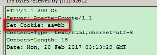

##中文文件下载

> 针对浏览器类型，对文件名字做编码处理 Firefox (Base64) , IE、Chrome ... 使用的是URLEncoder

		/*
		 * 如果文件的名字带有中文，那么需要对这个文件名进行编码处理
		 * 如果是IE ，或者  Chrome （谷歌浏览器） ，使用URLEncoding 编码
		 * 如果是Firefox ， 使用Base64编码
		 */
		//获取来访的客户端类型
		String clientType = request.getHeader("User-Agent");
		
		if(clientType.contains("Firefox")){
			fileName = DownLoadUtil.base64EncodeFileName(fileName);
		}else{
			//IE ，或者  Chrome （谷歌浏览器） ，
			//对中文的名字进行编码处理
			fileName = URLEncoder.encode(fileName,"UTF-8");
		}
##请求转发和重定向
### 重定向

			    response.setContentType("text/html;charset=UTF-8,pageEncoding=UTF-8");
				//    response.setCharacterEncoding("UTF-8");
			
					String username = request.getParameter("username");
				    String password = request.getParameter("password");
				    if(username.equals("jinfeifei") && password.equals("213208")) {
				    	//重定向的第一种写法
			//	    	response.setStatus(302);
			//	    	response.setHeader("Location", "succeed.html");

				    	//重定向的第二种写法
				//    	response.sendRedirect("succeed.html");

				    }else {
				    	PrintWriter writer = response.getWriter();
				    	writer.write("登陆失败");
				    }

1. 地址栏上显示的是最后那个资源的地址

2. 请求的次数最少是两次，服务器第一次请求后，返回302，以及一个地址，浏览器根据这个地址进行第二次请求

3. 可以跳转到任意路径，不是该 工程下的也可以

4. 效率稍低一些，需要执行俩次请求。

5. 后续的请求没法使用上一次的request对象，因为对象已经改变，重定向后的页面的请求是当前的request对象。
### 请求转发

		//请求转发的写法
	    request.getRequestDispatcher("succeed.html").forward(request, response);

出现了乱码问题

1. 地址上显示的是请求Servlet的地址

2. 请求只有一次，因为服务器内部帮客户端执行了后续的请求。

3. 只能 跳转到自己工程下的资源路径

4. 效率稍高一些，因为只执行一次请求。

5. 可以使用上一次的request对象】

## Cookie
> 英文来讲意思是饼干，其实是一份小数据，服务器给客户端，并且存储在客户端上的一份小数据

### 应用场景

> 自动登录，浏览记录，购物车

### 为什么要有这个Cookie

> http的请求是无状态的。客户端与服务器在通讯的时候，是无状态的，其实就是客户端在第二次访问服务器的时候，服务器并不知道客户端以前是否来访过。  为了更好的 用户体验，更好的交互【自动登录】，从公司层面来讲，为了更好的收集用户习惯【大数据】

### Cookie怎么用？
#### 简单使用
* 添加cookie给客户端
	1. 在响应的时候，添加cookie
		
			Cookie cookie = new Cookie("aa", "bb"); 
		//给响应添加一个Cookie
		response.addCookie(cookie);
	2. 客户端收到的信息里面，响应头中多出了一个字段set-Cookie

* 获取客户端带过来的cookie

		      //获取服务器给客户端并且保存在客户端的cookie
				Cookie[] cookies = request.getCookies();
				if(cookies != null) {
					for(Cookie c:cookies) {
						String name = c.getName();
						String value = c.getValue();
						System.out.println("name = "+name+" value = "+value);
					}
				}
* 常用方法

		//可以添加多个Cookie
				Cookie cookie = new Cookie("name", "jinfeifei");
				//设置cookie的有效期
				//针对没有设置有效期的Cookie,默认参数值为-1,即关掉浏览器cookie就会失效
				//参数单位以秒计，为正值时即有效期的时间；为负值时关掉浏览器失效
				cookie.setMaxAge(60*60*24*2); 
				//赋值新的值
				cookie.setValue("aifei");
				//用于指定只有请求了指定的域名，才会带上该Cookie
				cookie.setDomain(".itheima.com");
				//只有访问该域名下的CookieDemo的这个路径才会带上Cookie
				cookie.setPath("/CookieDemo");
				//给响应添加一个Cookie
				response.addCookie(cookie);