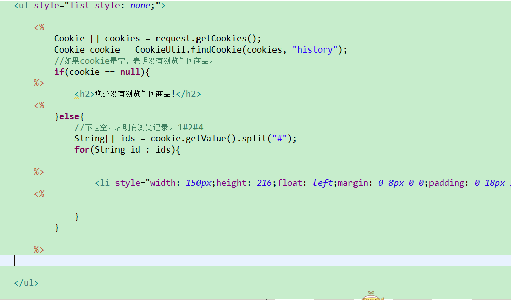
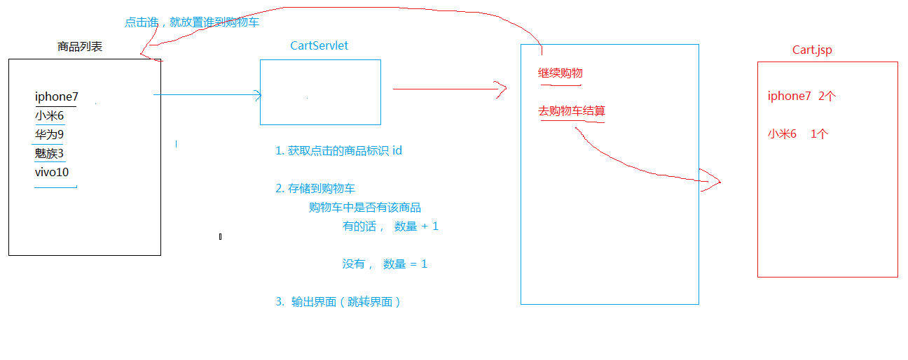

##中文文件下载

> 针对浏览器类型，对文件名字做编码处理 Firefox (Base64) , IE、Chrome ... 使用的是URLEncoder

		/*
		 * 如果文件的名字带有中文，那么需要对这个文件名进行编码处理
		 * 如果是IE ，或者  Chrome （谷歌浏览器） ，使用URLEncoding 编码
		 * 如果是Firefox ， 使用Base64编码
		 */
		//获取来访的客户端类型
		String clientType = request.getHeader("User-Agent");
		
		if(clientType.contains("Firefox")){
			fileName = DownLoadUtil.base64EncodeFileName(fileName);
		}else{
			//IE ，或者  Chrome （谷歌浏览器） ，
			//对中文的名字进行编码处理
			fileName = URLEncoder.encode(fileName,"UTF-8");
		}
##请求转发和重定向
### 重定向

			    response.setContentType("text/html;charset=UTF-8,pageEncoding=UTF-8");
				//    response.setCharacterEncoding("UTF-8");
			
					String username = request.getParameter("username");
				    String password = request.getParameter("password");
				    if(username.equals("jinfeifei") && password.equals("213208")) {
				    	//重定向的第一种写法
			//	    	response.setStatus(302);
			//	    	response.setHeader("Location", "succeed.html");

				    	//重定向的第二种写法
				//    	response.sendRedirect("succeed.html");

				    }else {
				    	PrintWriter writer = response.getWriter();
				    	writer.write("登陆失败");
				    }

1. 地址栏上显示的是最后那个资源的地址

2. 请求的次数最少是两次，服务器第一次请求后，返回302，以及一个地址，浏览器根据这个地址进行第二次请求

3. 可以跳转到任意路径，不是该 工程下的也可以

4. 效率稍低一些，需要执行俩次请求。

5. 后续的请求没法使用上一次的request对象，因为对象已经改变，重定向后的页面的请求是当前的request对象。
### 请求转发

		//请求转发的写法
	    request.getRequestDispatcher("succeed.html").forward(request, response);

出现了乱码问题

1. 地址上显示的是请求Servlet的地址

2. 请求只有一次，因为服务器内部帮客户端执行了后续的请求。

3. 只能 跳转到自己工程下的资源路径

4. 效率稍高一些，因为只执行一次请求。

5. 可以使用上一次的request对象】

## Cookie
> 英文来讲意思是饼干，其实是一份小数据，服务器给客户端，并且存储在客户端上的一份小数据

### 应用场景

> 自动登录，浏览记录，购物车

### 为什么要有这个Cookie

> http的请求是无状态的。客户端与服务器在通讯的时候，是无状态的，其实就是客户端在第二次访问服务器的时候，服务器并不知道客户端以前是否来访过。  为了更好的 用户体验，更好的交互【自动登录】，从公司层面来讲，为了更好的收集用户习惯【大数据】

### Cookie怎么用？
#### 简单使用
* 添加cookie给客户端
	1. 在响应的时候，添加cookie
		
			Cookie cookie = new Cookie("aa", "bb"); 
			//给响应添加一个Cookie
			response.addCookie(cookie);
	2. 客户端收到的信息里面，响应头中多出了一个字段set-Cookie

* 获取客户端带过来的cookie

		      //获取服务器给客户端并且保存在客户端的cookie
				Cookie[] cookies = request.getCookies();
				if(cookies != null) {
					for(Cookie c:cookies) {
						String name = c.getName();
						String value = c.getValue();
						System.out.println("name = "+name+" value = "+value);
					}
				}
* 常用方法

		//可以添加多个Cookie
				Cookie cookie = new Cookie("name", "jinfeifei");
				//设置cookie的有效期
				//针对没有设置有效期的Cookie,默认参数值为-1,即关掉浏览器cookie就会失效
				//参数单位以秒计，为正值时即有效期的时间；为负值时关掉浏览器失效
				cookie.setMaxAge(60*60*24*2); 
				//赋值新的值
				cookie.setValue("aifei");
				//用于指定只有请求了指定的域名，才会带上该Cookie
				cookie.setDomain(".itheima.com");
				//只有访问该域名下的CookieDemo的这个路径才会带上Cookie
				cookie.setPath("/CookieDemo");
				//给响应添加一个Cookie
				response.addCookie(cookie);

##例子一 显示最近访问的时间
1. 判断账号是否正确
2.  正确的话，获取cookie，如果是第一次登录，给客户端添加cookie，如果不是第一次，获取cookie,然后重置值, 给客户端添加cookie. 

		protected void doGet(HttpServletRequest request, HttpServletResponse response)
			throws ServletException, IOException {
			//设置浏览器显示响应的内容使用UTF-8
			response.setContentType("text/html;charset=UTF-8");
			//获取客户端的请求内容
			String username = request.getParameter("username");
			String password = request.getParameter("password");
        	 PrintWriter writer = response.getWriter();
        	 //获取cookie
			Cookie[] cookies = request.getCookies();
			Cookie cookie = GetCookieName.findCookie(cookies, "lastTime");
			//判断账号密码是否正确
			if (username.equals("jinfeifei") && password.equals("213208")) {
				//如果不是第一次登录
				if (cookie != null) {
					//获取cookie的lastTime的value
					String value = cookie.getValue();
					long time = Long.parseLong(value);
				
					//输出上次登录的时间
					writer.write("上次登录的时间是:" + new Date(time));
					//重新赋值
					cookie.setValue(System.currentTimeMillis() + "");
					cookie.setMaxAge(60 * 60 * 60 * 24);
					//给客户端添加Cookie
					response.addCookie(cookie);
				
				} else {
					//如果是第一次登录
					cookie = new Cookie("lastTime", System.currentTimeMillis() + "");
					cookie.setMaxAge(60 * 60 * 60 * 24);
					response.addCookie(cookie);
				
				}
			}else {
				writer.write("登陆失败");
			
				}
			}

工具类

			public class GetCookieName {
				/**
				 * 根据name从cookie数组里面找到对象并且返回
				 * @param cookies
				 * @param name
				 * @return
				 */
			  public static Cookie findCookie(Cookie[] cookies,String name) {
				  for (Cookie cookie : cookies) {
					if(cookie.getName().equals(name))
						return cookie;
				}
				  return null ;
			  }
		}

###分析

###Jsp 里面使用Java代码

* jsp

> Java Server Pager ---> 最终会翻译成一个类， 就是一个Servlet
> 在tomcat里面的work里面查看

* 定义全局变量

	<%! int a = 99; %>

* 定义局部变量

	<% int b = 999; %>
	
* 在jsp页面上，显示 a 和 b的值，
 
	<%=a %> 
	<%=b %>

###jsp显示浏览记录

###清除浏览记录

> 其实就是清除Cookie， 删除cookie是没有什么delete方法的。只有设置maxAge 为0 。

		Cookie cookie = new Cookie("history","");
		cookie.setMaxAge(0); //设置立即删除
		cookie.setPath("/CookieDemo02");
		response.addCookie(cookie);

###Cookie总结

1. 服务器给客户端发送过来的一小份数据，并且存放在客户端上。

2. 获取cookie， 添加cookie

	request.getCookie();

	response.addCookie();

3. Cookie分类

	会话Cookie
		默认情况下，关闭了浏览器，那么cookie就会消失。

	持久Cookie

		在一定时间内，都有效，并且会保存在客户端上。 

		cookie.setMaxAge(0); //设置立即删除

		cookie.setMaxAge(100); //100 秒

4. Cookie的安全问题。

> 由于Cookie会保存在客户端上，所以有安全隐患问题。  还有一个问题， Cookie的大小与个数有限制。 为了解决这个问题 ---> Session .浏览器应该支持每台 Web 服务器有 20 个 cookie，总共有 300 个 cookie，并且可能将每个 cookie 的大小限定为 4 KB。 

#Session

> 会话， Session是基于Cookie的一种会话机制。  Cookie是服务器端返回给客户端的一小份数据，并且存储在客户端上，Session
是数据存放在服务器 端。

### 常用API方法

				        // 获取Session
						HttpSession session = request.getSession();
						//得到会话ID
						session.getId();
						//取值
						session.getAttribute(name);
						//存值
						session.setAttribute(name, value);
						//移除值
						
						session.removeAttribute(name);

* Session何时创建  ，何时销毁
* 创建
> 如果在Servlet里面调用了request.getSession()

* 销毁

> session是存放在服务器的内存中的一份数据，当然可以持久化。Redis .即使关了浏览器，sesion也不会销毁
>   1. 关闭服务器
>   2. session会话时间过期。有效期过了，默认有效期：30分钟。查看tomcat--conf--web.xml

			

			    <session-config>
			        <session-timeout>30</session-timeout>
			    </session-config>

# 例子三  简单购物车

### cart.java

		protected void doGet(HttpServletRequest request, HttpServletResponse response) throws ServletException, IOException {
				response.setContentType("text/html;charset=UTF-8");
				String id = request.getParameter("id");
				String[] names = {"vivox23","vivoz3","oppoa57","华为","魅族"};
				String name = names[Integer.parseInt(id)];
				//获取购物车存放东西的Session
		 		Map<String,Integer> map = (Map<String, Integer>) request.getSession().getAttribute("cart");
				//session里面没有存放过任何东西
				if(map == null) {
					map =new LinkedHashMap<String ,Integer>();
					request.getSession().setAttribute(name, map);
				}
				//判断购物车里面该商品是否存放过
				if(map.containsKey(name)) {
				//如果已经存放过，物品数量加一
					map.put(name, map.get(name)+1);
				}else {
				//如果没有存放过
					map.put(name, 1);
				}
			
			response.getWriter().write("<h3><a href ='menu.jsp'>继续购物</a></h3>");
			response.getWriter().write("<h3><a href='cart.jsp'>去结算</a></h3>");
			
			}

### 移除Session中的对话

		HttpSession session = request.getSession();
		//移除attribute
		//session.removeAttribute("cart");
		//消除整个对话
		session.invalidate();
		response.sendRedirect("cart.jsp");
	}
cart.jsp

						<%@page import="java.util.Map"%>
				<%@ page language="java" contentType="text/html; charset=UTF-8"
				    pageEncoding="UTF-8"%>
				<!DOCTYPE html>
				<html>
				<head>
				<meta charset="UTF-8">
				<title>Insert title here</title>
				</head>
				<body>
				  <h2>购物车</h2>
				  <%
				    Map<String,Integer> map = (Map<String,Integer>)session.getAttribute("cart");
				  if(map!=null){
					  for(String name:map.keySet()){
						  int number = map.get(name);
						%>	
					
					  
					    		  <h3>名称：<%=name %>   数量：<%=number %></h3>
				<%
				}
				  }
				  %>
				  <h2><a href="Clear">清空购物车</a></h2>
				 </body>
				</html>

##总结：

* 请求转发和重定向（面试经常问。）

* Cookie

	服务器给客户端发送一小份数据， 存放在客户端上。

	基本用法：

		添加cookie

		获取cookie。

	演练例子：

		1. 获取上一次访问时间

		2. 获取商品浏览记录。

* 什么时候有cookie

	response.addCookie(new Cookie())

* Cookie 分类

		会话Cookie

			关闭浏览器，就失效

		持久cookie

			存放在客户端上。 在指定的期限内有效。 

			setMaxAge();

* Session

		也是基于cookie的一种会话技术，  数据存放存放在服务器端
	
		会在cookie里面添加一个字段 JSESSIONID . 是tomcat服务器生成。 

		setAttribute 存数据
 
		getAttribute 取数据

		removeAttribute  移除数据

		getSessionId();  获取会话id

		invalidate() 强制让会话失效。

* 创建和销毁

	，调用request.getSesion创建 
	
	 服务器关闭 ， 会话超时（30分）

setAttribute 存放的值， 在浏览器关闭后，还有没有。  有！，就算客户端把电脑砸了也还有。

