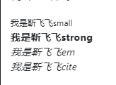
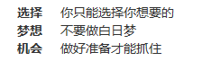
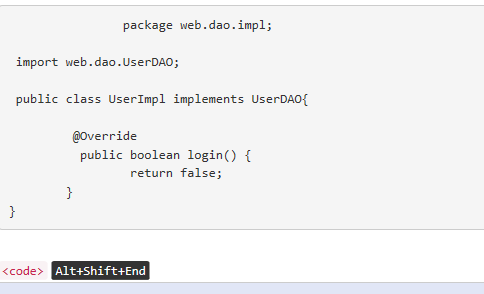
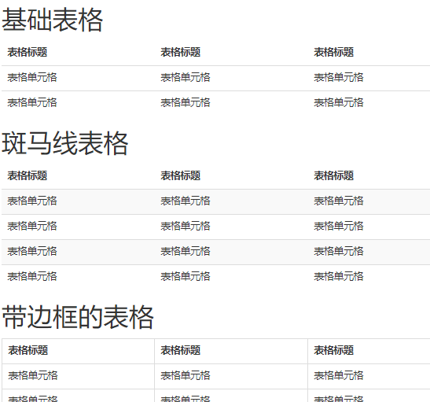
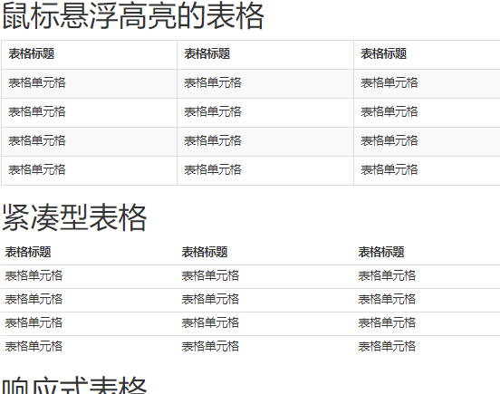
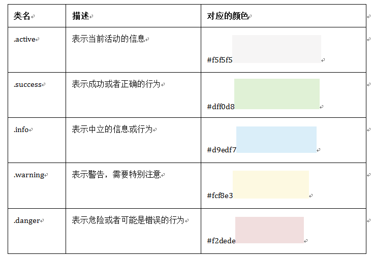
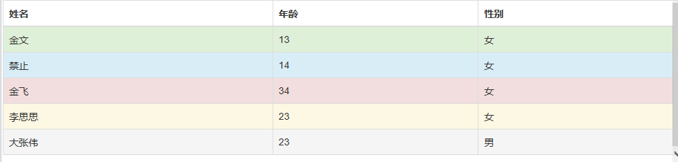

## bootstrap

### 是什么？
> 简单，灵活的用于搭建WEB页面的HTML,CSS,JavaScript的工具集。
> 是一款简洁强大的前端开发框架。 

### 意义
> 让WEB开发更迅速，更简单。

	2011年，twitter的“一小撮”工程师为了提高他们内部的分析和管理能力，用业余时间为他们的产品构建了一套易用、优雅、灵活、可扩展的前端工具集--BootStrap。Bootstrap由MARK OTTO和Jacob Thornton所设计和建立

### GitHub上这样介绍 bootstrap：

    ☑  简单灵活可用于架构流行的用户界面和交互接口的html、css、javascript工具集。

    ☑  基于html5、css3的bootstrap，具有大量的诱人特性：友好的学习曲线，卓越的兼容性，响应式设计，12列格网，样式向导文档。

    ☑  自定义JQuery插件，完整的类库，基于Less等。

## 基本的HTML模板

* bootstrap模板为使IE6、7、8版本（IE9以下版本）浏览器兼容html5新增的标签，引入下面代码文件即可。
		
		

* 同理为使IE6、7、8版本浏览器兼容css3样式，引入下面代码：

		
		 

- css 文件放在<head></head>标签里
- js 文件放在<body></body>后
-  因为js是基于jQuery ,所以导入文件时，Jquery在前，js在后。

        <meta name="viewport" content="width=device-width, initial-scale=1">

		意思：保持和物理设备一样的宽度，并且初始缩放比为1：1

实例：

		<!DOCTYPE html>
		<html lang="en">
    <head>
        <meta charset="utf-8">
        <meta http-equiv="X-UA-Compatible" content="IE=edge">
        <meta name="viewport" content="width=device-width, initial-scale=1">
        <title>Bootstrap的HTML标准模板</title>   
        <!-- Bootstrap -->
        <link href="css/bootstrap.min.css" rel="stylesheet">
        <!--你自己的样式文件 -->
        <link href="css/your-style.css" rel="stylesheet">        
        <!-- 以下两个插件用于在IE8以及以下版本浏览器支持HTML5元素和媒体查询，如果不需要用可以移除 -->
        <!--[if lt IE 9]>
        
        
        <![endif]-->
    </head>
    <body>
        <h1>Hello, world!</h1>
        
        <!-- 如果要使用Bootstrap的js插件，必须先调入jQuery -->
        
        <!-- 包括所有bootstrap的js插件或者可以根据需要使用的js插件调用　-->
         
    </body>
	</html>

## 标题（一）

> 标题的使用和平常使用是一样的，使用h1~h6标签 ， 分别表示标题一至标题六 ，h后面的数字越大，表示的级别越小，文本也越小。

---

> 在bootstrap中为了让非标题元素和标题使用相同的样式 ，特别定义了.h1~.h6六个类名。
> 效果与上面一样。

		<!--Bootstrap中的标题-->
		<h1>Bootstrap标题一</h1>
		<h2>Bootstrap标题二</h2>
		<h3>Bootstrap标题三</h3>
		<h4>Bootstrap标题四</h4>
		<h5>Bootstrap标题五</h5>
		<h6>Bootstrap标题六</h6>
		
		<!--Bootstrap中让非标题元素和标题使用相同的样式-->
		
Bootstrap标题一

		
Bootstrap标题二

		
Bootstrap标题三

		
Bootstrap标题四

		
Bootstrap标题五

		
Bootstrap标题六

## 标题（二）

> 在WEB制作中 ， 常常会碰到一个标题后面紧跟着一行小的副标题。在Bootstrap中，考虑这种排版效果，使用
 
			<small></small>
>标签来制作副标题。

1. 行高都为1，而且font-weight设置了normal变成了常规效果（不加粗），同时颜色被设置为灰色（#999）.
2.  由于small内的文本字体在h1~h3内，其大小都设置为当前字号的65%；而在h4~h6内的字号都设置为当前字号的75%。

## 段落（正文文本）

> 在bootstrap中为文本设置了一个全局的文本样式（所指正文文本）

源码：

		该几个属性都为继承属性
		body {
		font-family: "Helvetica Neue", Helvetica, Arial, sans-serif;
		font-size: 14px;
		line-height: 1.42857143;
		color: #333;
		background-color: #fff;
		}
		
		p {
 		   margin: 0 0 10px;
		}

## 强调内容

> 如果想让一个段落突出显示 ，  可以通过添加类名".lead" 实现， 其作用就是增大文本字号 ，加粗文本 ， 而且对行高和margin也做相应的处理。
		
		
我是普通文本，我的样子长成这样我是普通文本，我的样子长成这样我是普通文本，

		
我是特意要突出的文本，我的样子成这样。我是特意要突出的文本，我的样子长成这样。

源码：
			
			.lead {
			margin-bottom: 20px;
			font-size: 16px;
			font-weight: 200;
			line-height: 1.4;
			}
			@media (min-width: 768px) {/*大中型浏览器字体稍大*/
			.lead {
			font-size: 21px;
			  }
			}

> 除此， bootstrap还可通过元素标签：< small > < strong > < em >
> < cite > 给文本做出突出样式处理。

## 粗体

> 在普通的元素中一般使用font-weight设置为bold, 在bootstrap中，可以使用< b >,< strong >标签直接使文本加粗。

		b,strong {
  		font-weight: bold; /*文本加粗*/
		}

怎么使用：
			
			<!-- 粗体 -->
			 <b>金飞飞</b>
			 <strong>金飞飞</strong>
## 斜体
> 可以通过设置font-style值为italic实现之外，在bootstrap中还可以通过使用标签< em > < i >实现。

怎么使用：

		
我在慕课网上跟<em>大漠</em>一起学习<i>Bootstrap</i>的使用。我一定要学会<i>Bootstrap</i>。

##强调相关的类
> 这些强调类都是通过颜色来表示强调

* .text-muted:提示 ， 使用浅灰色（#999）
* .text-primary : 主要 ，使用蓝色（#428bca）
* .text-success : 成功 ， 使用浅绿色 （#3c763d）
* . text-info : 通知信息 ， 使用浅蓝色（#31708f）
* .text-warning : 警告 ， 使用黄色（#8a6d3b）
* .text-danger : 危险 ， 使用褐色（#a94442）

## 文本对齐风格
> 在CSS中 ， 设置text-align属性来实现文本对齐风格

	☑  左对齐，取值left

    ☑  居中对齐，取值center

    ☑  右对齐，取值right
 
    ☑  两端对齐，取值justify
>在bootstrap中，通过定义四个类名控制文本的对齐风格。

	☑ .text-left

	☑ .text-center

	☑ .text-right

	☑ .text-justify

怎么用？ 
		
		
我居左

		
我居中

		
我居右

		
我两端对齐

## 列表
> 在HTML文档中 ， 列表的结构主要有三种 ： 有序列表 ， 无序列表  ， 定义列表

1. 无序列表

			<ul>
				<li></li>
			</ul>
2. 有序列表

			<ol>
				<li></li>
			</ol>

3. 定义列表

			<dl>
				<dt></dt>
				<dd></dd>
			</dl>

> 在bootstrap中根据平时使用情形提供了六种形式的列表

			   ☑  普通列表
			
			   ☑  有序列表
			
			   ☑  去点列表
			
			   ☑  内联列表
			
			   ☑  描述列表
			
			   ☑  水平描述列表

*  无序列表   有序列表
> 在bootstrap中和平时使用方法一样，知识margin稍微做了一些调整。 也可以嵌套。

* 去点列表（即去掉前面的项目符号）
> 通过给无序列表或者有序列表添加一个类名---.list-unstyled----，这样可以去除默认的列表样式的风格。

* 内联列表
> 通过添加----“.list-inline”------来实现内联列表 ， 就是把垂直列表换成水平列表 ， 而且去掉项目符号，保持水平显示。 也可以说，内联列表就是为制作水平导航而生。

		<ul class="list-inline">
   	 		<li>W3cplus</li>
    		<li>Blog</li>
    		<li>CSS3</li>
    		<li>jQuery</li>
   			 <li>PHP</li>
		</ul>

* 定义列表
> bootstrap中只是调整了行间距 ， 外边距 ，字体加粗效果。

			<dl>
    			<dt>W3cplus</dt>
    			<dd>一个致力于推广国内前端行业的技术博客</dd>
    			<dt>慕课网</dt>
   				<dd>一个真心在做教育的网站</dd>
			</dl>

* 水平定义列表
> 通过给dl标签添加类名----“.dl-horizontal”----- ，来实现水平显示效果。
	
			有添加了一个媒体查询			
				@media (min-width: 768px) {
				.dl-horizontal dt {
				float: left;
				width: 160px;
				overflow: hidden;
				clear: left;
				text-align: right;
				text-overflow: ellipsis;
				white-space: nowrap;
				  }
				.dl-horizontal dd {
				margin-left: 180px;
				  }
				}

> 只有屏幕大于768px时，添加类名才有水平定义列表的效果。主要实现方式

1. 将dt设置了左浮动，并且设置宽度为160Px
2. 将dd设置margin-left为180px,达到水平的效果
3. 当标题宽度超过160px时，将会显示三个省略号

## 代码（一）

1. 使用< code >< /code >来显示单行内联代码
2. 使用< pre >< /pre >来显示多行块代码
3. 使用< kbd >< /kbd >来显示用户输入代码 

> 在使用时可根据需求选择：

1. < code >:一般用于单个单词或者单个句子
2.  < pre >: 一般针对多行代码
3.  < kbd >: 一般表示用户通过键盘输入的内容

code风格：
					
					<code>&lt;code&gt;</code>
					

pre风格：

			
					<pre>
							package web.dao.impl;
					
					 import web.dao.UserDAO;
					
					 public class UserImpl implements UserDAO{
					 
						 @Override
						  public boolean login() {	
							 return false;
						}
					}		
					</pre> 
kbd风格：

		<kbd>Alt+Shift+End</kbd>

不管使用哪种代码风格，在代码中碰到小于号（<）要使用硬编码“&lt;”来替代，大于号(>)使用“&gt;”来替代。

## 代码（二）

> &lt;pre&gt;元素一般用于显示大块的代码，并保证原有格式不变。但有时候代码太多，但是不想让其占据太大页面篇幅，因此控制代码块的大小。

> bootstrap中在&lt;pre&gt;里面添加类名-----“.pre-scrollable”------ ，就可以控制代码区域最大高度为340px ， 一旦超出该高度，就会在<strong>Y轴出现滚动条</strong>。

## 表格
> 表格是bootstrap的一个基础组件之一，bootstrap为表格提供了1种基础样式和4种附加样式以及一个支持响应式的表格。在使用bootstrap的表格时,只需要添加对应的类名就可以得到不同的表格风格。

			  ☑  .table：基础表格
			
			  ☑  .table-striped：斑马线表格
			
			  ☑  .table-bordered：带边框的表格
			
			  ☑  .table-hover：鼠标悬停高亮的表格
			
			  ☑  .table-condensed：紧凑型表格
			
			  ☑  .table-responsive：响应式表格

怎么用？

		<table class="table table-hover table-bordered">

## 表格行的类
> bootstrap为表格的行元素&lt;tr&gt;提供了五种不同的类名，每种类名控制了行的不同背景颜色

怎么用？

				<tr class="active">
				    <td>…</td>
				</tr>
特别提示：
> 除了”.active”之外，其他四个类名和”.table-hover”配合使用时，Bootstrap针对这几种样式也做了相应的悬浮状态的样式设置，所以如果需要给tr元素添加其他颜色样式时，在”.table-hover”表格中也要做相应的调整。
			
			<table class="table table-hover table-bordered">
			<thead>
				<tr>
					<th>姓名</th>
					<th>年龄</th>
					<th>性别</th>
				</tr>
			</thead>
			<tbody>
			<tr class="success">
				<td>金文</td>
				<td>13</td>
				<td>女</td>
			</tr>
			<tr class="info">
				<td>禁止</td>
				<td>14</td>
				<td>女</td>
			</tr>
			<tr class="danger">
				<td>金飞</td>
				<td>34</td>
				<td>女</td>
			</tr>
			<tr class="warning">
				<td>李思思</td>
				<td>23</td>
				<td>女</td>
			</tr>
			<tr  class="active">
				<td>大张伟</td>
				<td>23</td>
				<td>男</td>
			</tr>
			</tbody>	
			
			</table>

### 1  基础表格
> bootstrap中，对于基础表格通过类名----".table"------来控制。如果在&lt;table&gt;元素中不添加任何类名，表格没有任何效果。

怎么用？

		<table class="table">
				...
		</table>

作用
1. 给表格设置了margin-bottom:20px以及设置单元内距
2. 在thead底部设置了一个2Px的浅灰实线
3. 每个单元格顶部设置了1px的浅灰实线

### 2. 斑马线表格
> 添加类名 -----“.table-striped”-------

怎么用？

			<table class="table table-striped">
			...
			</table>

### 带边框的表格
> 添加类名-----".table-bordered"------

怎么用？

			<table class="table table-bordered">
			...
			</table>

### 鼠标悬浮高亮的表格
> 添加类名------".table-hover"-----

怎么用？

			<table class="table table-hover">
			...
			</table>

### 紧凑型表格
> 即单元格没内距或者内距较其他表格的内距更小。即重置表格单元格的内距padding(8px-5px)的值。
> -----通过添加类名----“.table-condensed”------来实现。

怎么用？

 			<table class="table table-condensed">
			...
			</table>

### 响应式表格
> 想让web页面适用各种设备浏览，需要响应式的设计。在bootstrap中提供了响应式表格，即通过提供一个容器，并把此容器设置类名----“.table-responsive”----，此容器就会有响应式的效果。然后将table置于这个容器中。

> bootstrap的响应式表格表现为：当浏览器可视区域小于768px时，<b>表格底部出现水平滚动条</b>,当浏览器可视区域大于768px时，表格底部的水平滚动条就会消失。

怎么用？

				

					<table class="table table-bordered">
  					 …
					</table>
				

## 表单
### 基础表单
> 表单主要功能是用来与用户做交流的一个网页控件，良好的表单设计能够让网页与用户更好的沟通。表单中常见的元素主要有：<b>文本输入框，下拉选择框，单选按钮，复选按钮，文本域，按钮...</b>其中每个控件所起的作用各不相同，而且不同的浏览器对表单空间渲染的风格都各不同。

> 表单也是bootstrap框架中的核心内容。

---
> 对于基础表单，bootstrap并未对其做太多的定制型的效果设计，仅仅对表单内的fieldset,legend,label标签进行了定制。主要将这些元素的margin,padding,border进行了细化设置。

> 当然表单除了这几个元素之外，还有input,selet,textarea...元素，在bootstrap框架中，通过定制了一个类名<b>-----".form-control"-----</b>,实现一些设计上定制的效果。

1. 宽度100%
2. 设置了一个浅灰色（#ccc）的边框
3. 具有4px的圆角
4. 设置阴影效果，并且元素得到焦点的时候，阴影和边框效果会有所变化。
5. 设置了placeholder的颜色为#999

		<form role="form">
		  

		    <label for="exampleInputEmail1">邮箱：</label>
		    <input type="email" class="form-control" id="exampleInputEmail1" placeholder="请输入您的邮箱地址">
		  

		  

		    <label for="exampleInputPassword1">密码</label>
		    <input type="password" class="form-control" id="exampleInputPassword1" placeholder="请输入您的邮箱密码">
		  

		  

		    <label>
		      <input type="checkbox"> 记住密码
		    </label>
		  

		  <button type="submit" class="btn btn-default">进入邮箱</button>
		</form>	

### 水平表单
> bootstrap框架默认的表单是垂直显示风格，一般使用水平表单风格，即标签在左，控件在右。

在Bootstrap框架中要实现水平表单，需满足俩个条件：

1. &lt;form&gt;元素使用类名---".form-horizontal"----
2. 配合bootstrap框架的网格系统

使用该类名的作用：

1. 设置表单控件padding和margin的值
2. 改变“.form-group”的表现形式，类似于网格系统的“row”;

			role是一个html5的属性，role="form"告诉辅助设备（如屏幕阅读器）这个元素所扮演的角色是个表单，在button中role="button"就是
			告诉设备，这是个按钮，可以点击。本质上是增强语义性，增强组件的可访问性、可用性和可交
			<form class="form-horizontal" role="form">
			  

			    <label for="inputEmail3" class="col-sm-2 control-label">邮箱</label>
			    

			      <input type="email" class="form-control" id="inputEmail3" placeholder="请输入您的邮箱地址">
			    

			  

			  

			    <label for="inputPassword3" class="col-sm-2 control-label">密码</label>
			    

			      <input type="password" class="form-control" id="inputPassword3" placeholder="请输入您的邮箱密码">
			    

			  

			  

			    

			      

			        <label>
			          <input type="checkbox"> 记住密码
			        </label>
			      

			    

			  

			  

			    

			      <button type="submit" class="btn btn-default">进入邮箱</button>
			    

			  

			</form> 
						
			
