# 网格系统
## 基本用法
> 通过列的组合，即将一行分成了多少列。更改数字合并列，不能超过总数。
row必须放在container下
怎么用？
		
		

		  

		    
.col-md-4

		    
.col-md-8

		  

		  

		    
.col-md-4

		    
.col-md-4

		    
.col-md-4

		  

		  

		    
.col-md-3

		    
.col-md-6

		    
.col-md-3

		 

		

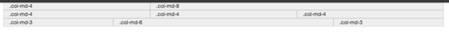

### 列偏移
> 如果不希望俩个相邻的列紧靠在一起。可以使用列偏移（offset）功能实现。

怎么用？
需要在列元素添加类名-----“.col-md-offset-*”------（*代表偏移列组合数）
		
		

			

				
col-md-4

				
col-md-3

				
col-md-2

			

		

移动后总共不能超过12列

### 列排序
> 即改变列的方向，就是改变左右浮动，可以将列左右移动。  
> -----“.col-md-push-*”-----向右移动  
> -----“.col-md-pull-*”-----向左移动

怎么用？
在列元素上添加类名
		
		两列网格交换位置
		

		  

		    
.col-md-4

		    
.col-md-8

		  

		

### 列的嵌套
		
		

		  

		    

		      我的里面嵌套了一个网格
		      

		        
col-md-6

		        
col-md-6

		      

		    

		    
col-md-4

		  

		  

		    
.col-md-4

		    

		      我的里面嵌套了一个网格
		      

		        
col-md-4

		        
col-md-4

		        
col-md-4

		      

		    

		  

		

# 菜单 ，按钮 ，导航
## 下拉菜单（基本用法）
> 在使用bootstrap框架的下拉菜单，必须调用bootstrap框架提供的bootstrap.js,因为bootstrap组件交互效果都是依赖于jquery.js，所以要加在前面。
		
示例：

		

		<button type="button" class="btn btn-info dropdown-toggle" data-toggle="dropdown">下拉菜单
		 
		</button>
		<ul class="dropdown-menu" role="menu">
			<li><a>香蕉</a></li>
			<li><a>苹果</a></li>
			<li><a>葡萄</a></li>
			<li><a>橘子</a></li>
		</ul>
	

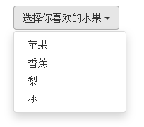
怎么用？

1. 使用一个名为"dropdown"的容器包裹了整个下拉菜单元素
2. 使用一个&lt;button&gt;按钮作为父菜单，并且定义类名为“.dropdown-toggle”和自定义".data-toggle"属性，值与最外容器类名一致。
3. 下拉菜单项使用一个ul列表，并且定义一个类名为".dropdown-menu"

## 下拉菜单（下拉分隔线）

怎么用？   
在组与组中间添加一个空的< li >并且添加类名“. divider”来实现分隔线的功能。

		

				<button type="button" class="btn btn-info dropdown-toggle" data-toggle="dropdown">下拉菜单
				 
				</button>
				<ul class="dropdown-menu" role="menu">
					<li><a>香蕉</a></li>
					<li><a>苹果</a></li>

					<li class="divider"></li>

					<li><a>葡萄</a></li>
					<li><a>橘子</a></li>
				</ul>
			

## 下拉菜单（菜单标题）
> 给菜单项添加类名----".dropdown-header"------

		<li class="dropdown-header">这是菜单一的标题</li>

## 下拉菜单（对齐方式）
> 通过给下拉菜单添加类名

1. .pull-right 向父容器的右边对齐
2. .dropdown-menu-right ...
3. .dropdown-menu-left  向父容器的左边对齐（默认样式）

		<ul class="dropdown-menu pull-right"></ul>

## 下拉菜单（菜单项状态）
> 在li元素上添加类名即可

1. 悬浮状态   :hover默认
2. 焦点状态   ：focus 默认
3. 当前状态    .active
4. 禁用状态    .disabled

		<li class="active"></li>

## 按钮（按钮组）
> 使用一个名为“.btn-group”的容器，将多个按钮放在这个容器中。
		
		

		  <button type="button" class="btn btn-default">
		     
		  </button>
		   …
		  <button type="button" class="btn btn-default">
		     
		  </button>
		

## 按钮（按钮工具栏）
> 只需要将按钮组"btn-group"按组放在一个大的容器".btn-toolbar"中

设置按钮组的大小  
1. .btn-group-lg
2. .btn-group-sm
3. .btn-group-xs

示例：
	
	

	  

	    <button type="button" class="btn btn-default"></button>
	    <button type="button" class="btn btn-default"></button>
	    <button type="button" class="btn btn-default"></button>
	    <button type="button" class="btn btn-default"></button>
	  

	  

	    <button type="button" class="btn btn-default"></button>
	    <button type="button" class="btn btn-default"></button>
	  

	  

	    <button type="button" class="btn btn-default"></button>
	    <button type="button" class="btn btn-default"></button>
	    <button type="button" class="btn btn-default"></button>
	  

	  

	    <button type="button" class="btn btn-default"></button>
	    <button type="button" class="btn btn-default"></button>
	  

	

	 
	 
	

	  

	    <button type="button" class="btn btn-default"></button>
	    <button type="button" class="btn btn-default"></button>
	    <button type="button" class="btn btn-default"></button>
	    <button type="button" class="btn btn-default"></button>
	  

	  

	    <button type="button" class="btn btn-default"></button>
	    <button type="button" class="btn btn-default"></button>
	  

	  

	    <button type="button" class="btn btn-default"></button>
	    <button type="button" class="btn btn-default"></button>
	    <button type="button" class="btn btn-default"></button>
	  

	  

	    <button type="button" class="btn btn-default"></button>
	    <button type="button" class="btn btn-default"></button>
	  

	

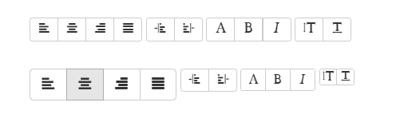

## 嵌套分组
> 把制作下拉菜单的“.dropdown” 换成".btn-group"，然后和普通按钮放在一级
		
			

		  <button class="btn btn-default" type="button">首页</button>
		  <!--<button class="btn btn-default" type="button">产品展示</button>-->
		  

		      <button type="button" class="btn btn-default dropdown-toggle" data-toggle="dropdown">产品展示
		          
		      </button>
		      <ul class="dropdown-menu">
		          <li><a>收割机</a></li>
		          <li><a>电动机</a></li>
		          <li><a>拖拉机</a></li>
		          <li><a>电动车</a></li>
		      </ul>
		  

		  <button class="btn btn-default" type="button">案例分析</button>
		  <button class="btn btn-default" type="button">联系我们</button>
		  

		      <button class="btn btn-default dropdown-toggle" data-toggle="dropdown" type="button">关于我们</button>
		    <ul class="dropdown-menu">
		    	<li><a href="##">公司简介</a></li>
		    	<li><a href="##">企业文化</a></li>
		    	<li><a href="##">组织结构</a></li>
		    	<li><a href="##">客服服务</a></li>
		    </ul>
		  

		

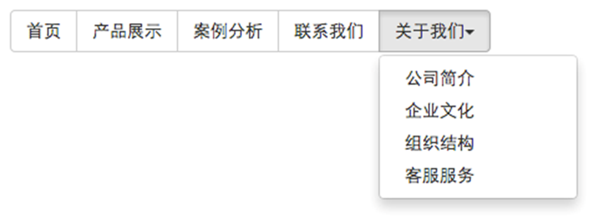
## 垂直分组
> 只需要将水平分组的".btn-group"换成".btn-group-vertical"即可。

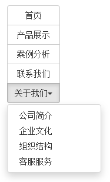

##  按钮（等分按钮，自适应按钮组）
> 按钮组里面的每个按钮平分按钮组的宽度，只需要在按钮组“.btn-group”追加一个---“.btn-group-justified”---类名即可。

			

	
		

	    

	    <a class="btn btn-default" href="#">首页</a>
	    <a class="btn btn-default" href="#">产品展示</a>
	    <a class="btn btn-default" href="#">案例分析</a>
	    <a class="btn btn-default" href="#">联系我们</a>
  

## 按钮下拉菜单
> 从外观上与下拉菜单效果基本一样。不同的是在普通下拉菜单的基础上封装了按钮的样式效果。（即点击一个按钮会显示隐藏的下拉菜单）

> 其实就是把a元素换成了button元素。唯一不同就是外部容器的".dropdown"换成了"btn-group"。

## 按钮的向下向上三角形
向下

		
向上
			button元素上添加类名 ---".dropup"
			

## 标签形tab导航（选项卡导航）
>适用于很多内容分块显示时

> 通过在原导航的基础上添加类名-----".nav-tabs"-------实现
		
		<ul class="nav nav-tabs">
		     <li><a href="##">Home</a></li>
		     <li><a href="##">CSS3</a></li>
		     <li><a href="##">Sass</a></li>
		     <li><a href="##">jQuery</a></li>
		     <li><a href="##">Responsive</a></li>
		</ul>

设置当前状态  “.active”  
设置禁用状态  “.disabled”

## 胶囊型导航
> 通过在原导航的基础上添加类名-----".nav-pills"-------实现

## 垂直堆叠的导航
> 在nav-pills的基础上添加类名-----".nav-stacked"----即可

导航里面添加分隔线

		<li class="nav-divider"></li>

## 自适应导航
> 在.nav-tabs / .nav-pills 后添加类名 .nav-justified即可。
		
		<ul class="nav nav-tabs nav-justified">
		     <li class="active"><a href="##">Home</a></li>
		     <li><a href="##">CSS3</a></li>
		     <li><a href="##">Sass</a></li>
		     <li><a href="##">jQuery</a></li>
		     <li><a href="##">Responsive</a></li>
		</ul>
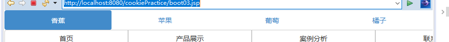

## 导航加下拉菜单（二级导航）
> 将li元素当作父容器，适用类名".dropdown"来实现下拉菜单

		<ul class="nav nav-tabs nav-justified">
    <li><a>首页</a></li>
    <li class="dropdown">
        <a class="dropdown-toggle" data-toggle="dropdown">
            教程
            
        </a>
        <ul class="dropdown-menu">
            <li><a href="##">CSS3</a></li>
        <li><a href="##">Sass</a></li>
        <li><a href="##">jQuery</a></li>
        <li><a href="##">Responsive</a></li>
        </ul>
        </li>  
	<li><a>关于我们</a></li>
	</ul>

## 面包屑式导航
> 为ol元素添加类名------".breadcrumb"------
		
		<ol class="breadcrumb">
		  <li><a href="#">首页</a></li>
		  <li><a href="#">我的书</a></li>
		  <li class="active">《图解CSS3》</li>
		</ol>

## 基础导航条
1. 首先在制作导航的列表（< ul  class="nav">）基础上添加类名----“.navbar-nav”
2. 在列表外部添加一个容器（< div >）,并且使用类名".navbar"和".navbar-default"
		
		

		  	<ul class="nav">
				<li><a>苹果</a></li>
				<li><a>葡萄</a></li>
				<li><a>橘子</a></li>
			</ul>
		

## 为导航条添加标题，二级菜单及状态
### 添加标题
> 通过类名".navbar-header"和".navbar-brand"来实现
	
	

	  　

	  　    <a href="##" class="navbar-brand">慕课网</a>
	  　

	    <ul class="nav navbar-nav">
		   <li class="active"><a href="##">网站首页</a></li>
	       <li><a href="##">系列教程</a></li>
	       <li><a href="##">名师介绍</a></li>
	       <li><a href="##">成功案例</a></li>
	       <li><a href="##">关于我们</a></li>
		 </ul>
	

### 状态
1. 当前状态  ".active"
2. 悬浮状态  ：hover 默认
3. 禁用状态  ".disabled"

### 二级菜单
> 即把下拉菜单和其他选项放在同一级
		
		<!--导航条状态及二级菜单-->
		

		  　

		  　    <a href="##" class="navbar-brand">慕课网</a>
		  　

			<ul class="nav navbar-nav">
			 	<li class="active"><a href="##">网站首页</a></li>
		        <li class="dropdown">
		          <a href="##" data-toggle="dropdown" class="dropdown-toggle">系列教程</a>
		          <ul class="dropdown-menu">
		        	<li><a href="##">CSS3</a></li>
		        	<li><a href="##">JavaScript</a></li>
		        	<li class="disabled"><a href="##">PHP</a></li>
		          </ul>
		       </li>
		       <li><a href="##">名师介绍</a></li>
		       <li><a href="##">成功案例</a></li>
		       <li><a href="##">关于我们</a></li>
			</ul>
		

## 带表单的导航条

> 即在navbar容器中放置一个带有nav-form类名的表单。---".navform-left"让表单向左浮动，---".navform-right"让表单向右浮动。
		
			

	  　

	  　    <a href="##" class="navbar-brand">慕课网</a>
	  　

	    <ul class="nav navbar-nav">
	       <li class="active"><a href="##">网站首页</a></li>
	       <li class="dropdown">
	          <a href="##" data-toggle="dropdown" class="dropdown-toggle">系列教程</a>
	          <ul class="dropdown-menu">
	        	<li><a href="##">CSS3</a></li>
	        	<li><a href="##">JavaScript</a></li>
	        	<li class="disabled"><a href="##">PHP</a></li>
	          </ul>
	      </li>
	      <li><a href="##">名师介绍</a></li>
	      <li><a href="##">成功案例</a></li>
	      <li><a href="##">关于我们</a></li>
		 </ul>
	     <form action="##" class="navbar-form navbar-left" rol="search">
	   	    

	   		   <input type="text" class="form-control" placeholder="请输入关键词" />
	   	    

	        <button type="submit" class="btn btn-default">搜索</button>
	     </form>
	

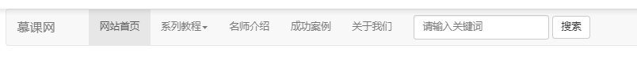

## 导航条中的按钮，文本和链接
1. 导航条中的按钮  navbar-btn
2. 导航条中的文本  navbar-text
3. 导航条中的普通链接  navbar-link

这三种样式在框架中使用受到一定限制,需要和navbar-brand,navbar-nav配合起来使用。而且对数量也有一定的限制，一般情况下使用一到俩个不会有问题，超过俩个就会有问题

navbar-text使用时存在问题，因此使用时按如下：
		
		

		　

		　    <a href="##" class="navbar-brand">慕课网</a>
		　

		  

		      <a href="##" class="navbar-text">Navbar Text</a>
		      <a href="##" class="navbar-text">Navbar Text</a>
		      <a href="##" class="navbar-text">Navbar Text</a>
		  

		

## 固定导航条

1. .navbar-fixed-top   ：导航条固定在浏览器窗口顶部
2.  .nav-fixed-bottom  :导航条固定在浏览器窗口底部

>在外层容器加类名即可

页面主内容被导航条遮住的解决方法

		body{
		padding-top : 70px; //有顶部导航条
		padding-bottom : 70px; //有底部导航条
			}

## 响应式导航条

使用方法：  

1. 保证在窄屏时需要折叠的内容必须包裹在一个< div >内 ，并且这个div加入类名“.collapse”,".navbar-collapse"。最后为这个div 添加一个class类名或者id名。  
2. 保证在窄屏时要显示的图标样式（固定写法）
		
		<button class="navbar-toggle" type="button" data-toggle="collapse">
		  Toggle Navigation
		  
		  
		  
		</button>
3. 并为button添加data-target=".类名/#id名"，由需要折叠的div决定。
			
			

			  

			     　<!-- .navbar-toggle样式用于toggle收缩的内容，即nav-collapse collapse样式所在元素 -->
			       <button class="navbar-toggle" type="button" data-toggle="collapse" data-target=".navbar-responsive-collapse">
			         Toggle Navigation
			         
			         
			         
			       </button>
			       <!-- 确保无论是宽屏还是窄屏，navbar-brand都显示 -->
			       <a href="##" class="navbar-brand">慕课网</a>
			  

			  <!-- 屏幕宽度小于768px时，div.navbar-responsive-collapse容器里的内容都会隐藏，显示icon-bar图标，当点击icon-bar图标时，再展开。屏幕大于768px时，默认显示。 -->
			  

			    	<ul class="nav navbar-nav">
			      		<li class="active"><a href="##">网站首页</a></li>
			      		<li><a href="##">系列教程</a></li>
			      		<li><a href="##">名师介绍</a></li>
			      		<li><a href="##">成功案例</a></li>
			      		<li><a href="##">关于我们</a></li>
				 	</ul>
			  

			

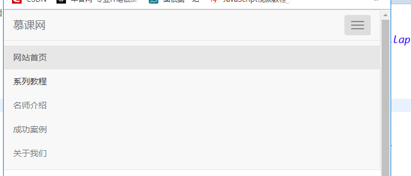

## 反色导航条
> 在基础导航条的基础上将“.navbar-default” 换成".navbar-inverse"

## 分页导航（带页码的分页导航）
> 在ul标签上添加类名----".pageination"即可。

要禁用禁用状态和当前状态不能点击，要么依赖js来实现，要么把这俩种状态下的a标签换成span标签。

设置大小  
1. pageination-lg  
2. pageination-sm
		
		<ul class="pagination pagination-lg">
		  <li><a href="#">&laquo;第一页</a></li>
		  <li><a href="#">11</a></li>
		  <li><a href="#">12</a></li>
		  <li class="active"><a href="#">13</a></li>
		  <li><a href="#">14</a></li>
		  <li><a href="#">15</a></li>
		  <li class="disabled"><a href="#">最后一页&raquo;</a></li>
		</ul> 

## 分页导航（翻页分页导航）

> 给ul标签添加类名----“.pager”即可。
		
		<ul class="pager">
		   <li><a href="#">&laquo;上一页</a></li>
		   <li><a href="#">下一页&raquo;</a></li>
		</ul>

对齐样式设置  
   ☑   previous：让“上一步”按钮居左

   ☑   next：让“下一步”按钮居右
		
		<ul class="pager">
		   <li class="previous"><a href="#">&laquo;上一页</a></li>
		   <li class="next"><a href="#">下一页&raquo;</a></li>
		</ul>

状态样式设置
> 如果在li标签上添加了disabled类名，分页按钮处于禁用状态，但不能禁止其点击功能。
> 要么用js处理，要么将a标签换成span标签。
		
		<ul class="pager">
		  <li class="disabled">&laquo;上一页</li>
		  <li><a href="#">下一页&raquo;</a></li>
		</ul>

## 标签

> 比如说添加了一个新导航时，会添加一个new 标签告诉用户这是新的导航。

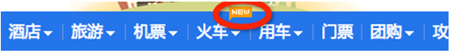

怎么用？

		<h3>Example heading New</h3>
				
		默认标签
		主要标签
		成功标签
		信息标签
		警告标签
		错误标签

## 会徽章
> 用于做提示性的信息，就像qq提醒有多少条信息没读一样。按钮和胶囊型导航也适用。

怎么用？

	 <a href="#">Inbox 42</a>

示例：
		
		<!--代码-->
		<a href="#">Inbox 42</a> 
		<!--navbar-default导航条勋章-->
		

		  　

		  　    <a href="##" class="navbar-brand">慕课网</a>
		  　

			<ul class="nav navbar-nav">
			 	<li class="active"><a href="##">网站首页</a></li>
		        <li><a href="##">系列教程</a></li>
		        <li><a href="##">名师介绍</a></li>
		        <li><a href="##">成功案例23</a></li>
		        <li><a href="##">关于我们</a></li>
			</ul>
		

		<!--nav-pills导航条勋章-->
		<ul class="nav nav-pills">
		  <li class="active"><a href="#">Home 42</a></li>
		  <li><a href="#">Profile</a></li>
		  <li><a href="#">Messages 3</a></li>
		</ul>
		  
		<ul class="nav nav-pills nav-stacked" style="max-width: 260px;">
		      <li class="active">
		        <a href="#">
		          42
		          Home
		        </a>
		      </li>
		      <li><a href="#">Profile</a></li>
		      <li>
		        <a href="#">
		          3
		          Messages
		        </a>
		      </li>
		</ul>
		 
		<!--按钮勋章-->
		<button class="btn btn-primary" type="button">
		      Messages 4
		</button> 

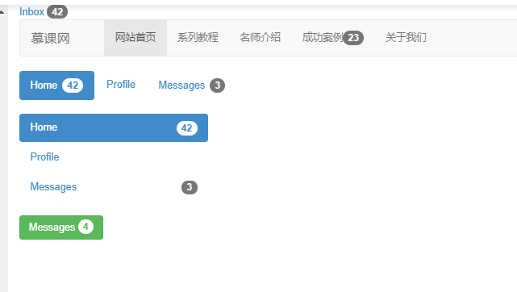

# 其他内置组件

## 缩略图（一）

> 通过类名----“.thumbnail”和bootstrap网格系统来实现。
	
	

	    

			

				
			

			

				
			

			

				
			

			

				
			

		

	

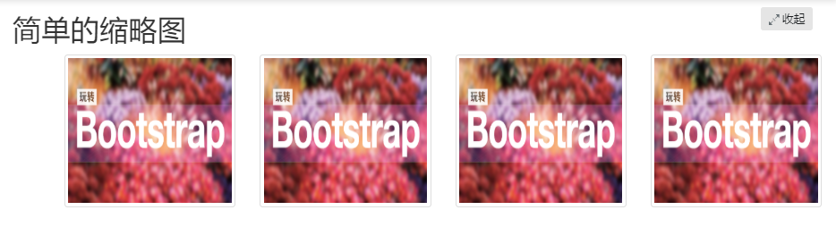

col-xs-6是什么意思？
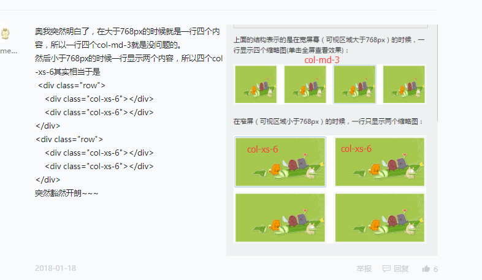

## 缩略图（二）
> 为缩略图添加标题，描述内容，按钮....在缩略图基础上添加一个div容器，设置类名".caption",里面放置其他内容。
		
		

		    

		        

		            
		            

		                <h3>Bootstrap框架系列教程</h3>
		                
Bootstrap框架是一个优秀的前端框，就算您是一位后端程序员或者你是一位不懂设计的前端人员，你也能依赖于Bootstrap制作做优美的网站...

		                

		                    <a href="##" class="btn btn-primary">开始学习</a>
		                    <a href="##" class="btn btn-info">正在学习</a>
		                

		            

		        

		    …
		    

		

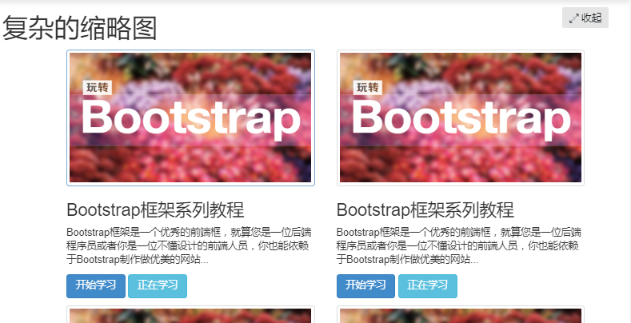
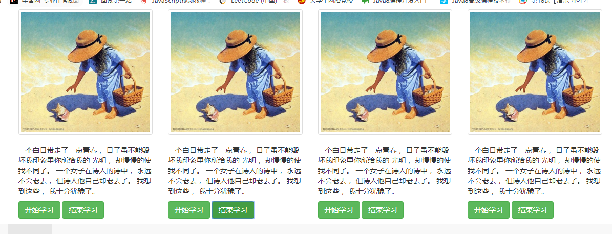

## 警示框
> 提供一些有效的警示框，比如告诉用户操作成功，错误....

## 警示框（默认警示框）
> 通过“.alert”样式实现，有四种：

1. 成功警示框  -----.alert-success
2. 信息警示框 -------.alert-info
3. 警告警示框  ------.alert-warning
4. 错误警示框  ------.alert-danger

怎么用？  
在类名为---".alert"的容器上追加对应类名，提示信息放入容器内。
		
		
alert-success

		
alert-info

		
alert-warning

		
alert-danger

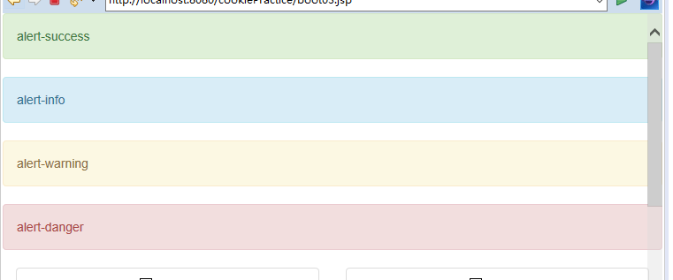

## 可关闭的警示框
1. 在基本警示框alert的基础上添加类名".alert-dismissable"
2. 在button标签中加入class="close"，实现关闭按钮的样式
3. 关闭按钮元素上设置自定义属性: "data-dismiss="alert""

## 警示框的链接

> 如果提示信息里面包含链接，对齐进行高亮显示和加粗处理

怎么用？  
给信息里面的链接添加类名----".alert-link"即可。

		<a class="alert-link">链接</a>
# 进度条
## 进度条----基本样式
> 提供俩个div容器，外容器添加类名----".progress"------,子容器添加类名----".progress-bar"-----,其中progress设置进度条的容器样式，proress-bar限制进度条的进度。
		
		

		       

		

结构优化：为残障人士  
		
		

		    

		        40% Complete
		    

		

1. role属性作用：告诉搜索引擎这个div的作用是进度条。

2. aria-valuenow="40"属性作用：当前进度条的进度为40%。

3. aria-valuemin="0"属性作用：进度条的最小值为0%。

4. aria-valuemax="100"属性作用：进度条的最大值为100%。

## 进度条---彩色进度条
> 在里面的容器上添加对应类名即可。

1. progress-bar-info  -------信息进度条   蓝色
2. progress-bar-success -----成功进度条   绿色
3. progress-bar-warning   -----警告进度条   黄色
4. progress-bar-danger   ------错误进度条   红色

				

					

				

		
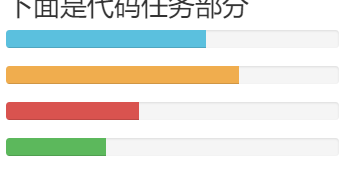

## 进度条----条纹进度条
> 只需要在外层容器上追加类名---".progress-striped"------即可。

## 进度条-----动态条纹进度条
> 只需要在外层容器".progress"和".progress-striped"的基础上追加类名----".active"即可。

## 进度条----层叠进度条
> 将不同状态的进度条水平方式排列。

怎么用？  
	
	

	    

	    

	    

	    

	

## 不良效果层叠进度条

> 所有状态进度条加起来大于100%；

## 层叠条纹进度条
		
		

			

			

			

			

		
  
		

			

			

			

			

		
 
		

			

			

			

			

		
 

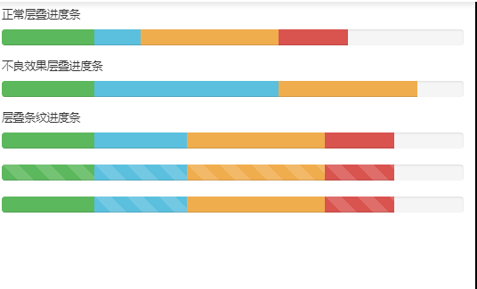

## 进度条-----带label的进度条
> 只需要在进度条中添加你需要的值。
		
		

		    
20%

		

# 媒体对象
> 在web页面或者移动页面制作中，图片居左，内容居右，通常这样的效果成为媒体对象，

## 媒体对象---默认媒体对象

媒体对象一般是成组出现，而一组媒体对象常常包括以下几个部分：
 
   ☑   媒体对像的容器：常使用“media”类名表示，用来容纳媒体对象的所有内容
 
   ☑  媒体对像的对象：常使用“media-object”表示，就是媒体对象中的对象，常常是图片

   ☑  媒体对象的主体：常使用“media-body”表示，就是媒体对像中的主体内容，可以是任何元素，常常是图片侧边内容

   ☑  媒体对象的标题：常使用“media-heading”表示，就是用来描述对象的一个标题，此部分可选

> 在Bootstrap框架中还常常使用“pull-left”或者“pull-right”来控制媒体对象中的对象浮动方式。
		
		

		    
		    

		        <h4 class="media-heading">系列：十天精通CSS3</h4>
		        
全方位深刻详解CSS3模块知识，经典案例分析，代码同步调试，让网页穿上绚丽装备！

		    

		

## 媒体对象----媒体对象的嵌套
> 只需要将另一个媒体对象结构放置在媒体对象的主体内---".media-body"内。
	
	

	    
		

			<h4 class="media-heading">我是大漠</h4>
			
我是W3cplus站长大漠，我在写Bootstrap框中的媒体对象测试用例

			

				
				

					<h4 class="media-heading">慕课网</h4>
					
大漠写的《玩转Bootstrap》系列教程即将会在慕课网上发布

					

						
						

							<h4 class="media-heading">W3cplus</h4>
							
W3cplus站上还有很多教程....

						

					

				

			

		

	

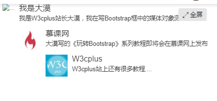

## 媒体对象---媒体对象列表
> 使用ul，在其上添加类名----".media-list"----
		
		<ul class="media-list">
		    <li class="media">
		        
		        

		            <h4 class="media-heading">Media Header</h4>
		            
…

		        

		    </li>
		    <li class="media">…</li>
		    <li class="media">…</li>
		</ul>

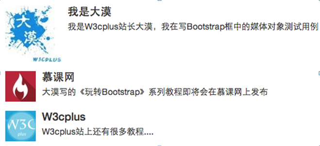

# 列表组
> 可以制作列表清单，垂直导航...配合其他组件制作更漂亮的组件。

## 列表组----基础列表组
包括俩部分  
1. list-group -----列表组容器，常用ul元素，也可以是ol或者div元素
2. list-group-item -----列表项，常用li元素，也可以是div元素。
		
		<ul class="list-group">
		    <li class="list-group-item">揭开CSS3的面纱</li>
		    <li class="list-group-item">CSS3选择器</li>
		    <li class="list-group-item">CSS3边框</li>
		    <li class="list-group-item">CSS3背景</li>
		    <li class="list-group-item">CSS3文本</li>
		</ul>
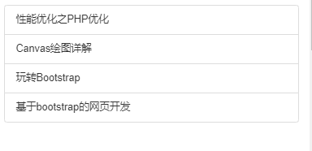

## 列表组----带徽章的列表组
> 即在列表项里面添加徽章即可。
		
		 <li class="list-group-item">
		        13揭开CSS3的面
		    </li>

## 列表组----带链接的列表组
		
		

		    <a href="##" class="list-group-item">图解CSS3</a>
		    <a href="##" class="list-group-item">220Sass教程</a>
		    <a href="##" class="list-group-item">玩转Bootstrap</a>
		

## 列表组-----自定义列表组
> 在链接列表组的基础上新增加了俩个样式

  ☑  list-group-item-heading：用来定义列表项头部样式

  ☑  list-group-item-text：用来定义列表项主要内容
		
		

		    <a href="##" class="list-group-item">
		        <h4 class="list-group-item-heading">图解CSS3</h4>
		        
Bootstrap框架是一个非常受欢迎的前端开发框架，他能让后端程序员和不懂设计的前端人员制作出优美的Web页面或Web应用程序。

		    </a>
		    <a href="##" class="list-group-item">
		        <h4 class="list-group-item-heading">Sass中国</h4>
		        
...

		    </a>
		

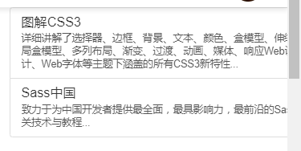

## 列表组---状态设置
1. .active  当前状态
2. .disabled  禁用状态
		
		<a href="##" class="list-group-item active">5902图解CSS3</a>

## 列表组-----多彩列表组
> 在列表项上追加类名即可。

  ☑  list-group-item-success：成功，背景色绿色

  ☑  list-group-item-info：信息，背景色蓝色

  ☑  list-group-item-warning：警告，背景色为黄色

  ☑  list-group-item-danger：错误，背景色为红色
		
		<a href="##" class="list-group-item list-group-item-success">15902W3cplus</a>

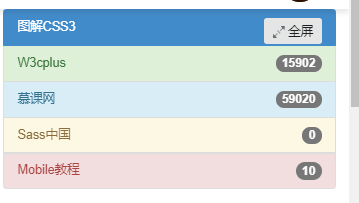

# 面板
> 用来处理一些其他组件无法完成的功能。bootstrap框架新增的一个组件

## 基础面板
> 一个div容器使用".panel"样式，产生一个具有边框的文本显示块。  
> ".panel-default"控制面板的主题颜色。  
> "div.panel-body"用来放置面板主体内容
		
		

		    
我是一个基础面板，带有默认主题样式风格

		

## 带有头和尾的面板
   ☑  panel-heading：用来设置面板头部样式

   ☑ panel-footer：用来设置面板尾部样式
		
		

		    
图解CSS3

		    
…

		    
作者：大漠

		

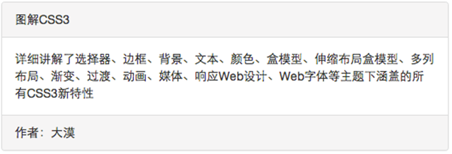

## 彩色面板
  ☑  panel-primary：重点蓝

  ☑  panel-success：成功绿

  ☑ panel-info:信息蓝

  ☑ panel-warning：警告黄

  ☑ panel-danger：危险红
		
		
…

## 面板中嵌套表格
		
		

		    
图解CSS3

		    
…

		    <table class="table table-bordered">…</table>

		    
作者：大漠

		

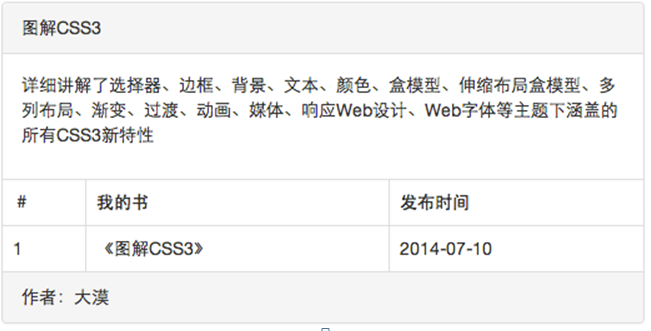

## 面板中嵌套列表组
		
		

		    
图解CSS3

		    
…

		    <ul class="list-group">
		        <li class="list-group-item">我是列表项</li>
		        <li class="list-group-item">我是列表项</li>
		        <li class="list-group-item">我是列表项</li>
		    </ul>

		    
作者：大漠

		

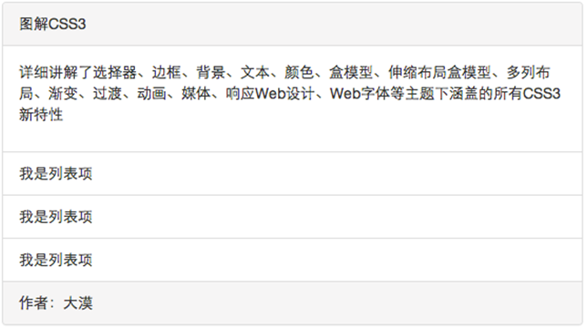