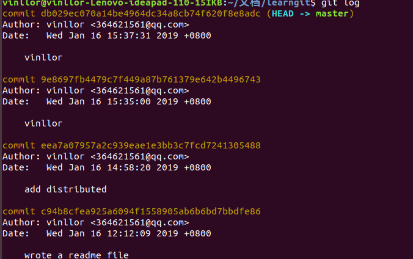

# 一 git介绍
> 目前世界上最先进的分布式管理系统
1. CVS SVN 集中式的版本控制系统
2. Git 分布式版本控制系统
### I. 集中式和分布式区别
>  &emsp;&emsp;集中式版本控制系统，版本库集中存放在中央服务器，每次修改都要从中央服务器取得最新的版本，修改完后将修改后的版本推送给服务器。  
>&emsp;&emsp; 缺点：  必须联网才能工作。

> &emsp;&emsp; 分布式版本控制系统，没有中央服务器，每个人的电脑都是一个完整的版本库。
 &emsp;&emsp;多个人之间如何协作呢？
只要把各自的修改推送给对方，就可以互相看到对方的修改了。 
 &emsp;&emsp;分布式版本控制系统通常也有一台充当“中央服务器”的电脑，但这个服务器的作用仅仅是用来方便交换大家的修改，没有他也一样可以工作，只是交换修改不方便而已。
 &emsp;&emsp;优点： 不必联网
-----
git  极其强大的分支管理。
###  II . git安装（ubuntu）
>  sudo apt-get install git
###  III . 创建版本库
repository[rɪˈpɒzətri]  仓库
>什么是版本库？
 &emsp;&emsp; 简单理解成一个目录，目录里的所有文件都可以被Git管理起来，每个文件的修改，删除，Git都可以跟踪，以便任何时刻可以追踪历史，或者在将来某个时刻可以“还原”。
1. 选择一个合适的地方，创建一个新目录

 > mkdir learngit  
cd learngit  
pwd  
 /home/vinllor/文档/learngit  

pwd  用来显示当前目录 
2. 将目录变成可以管理的仓库
> git init  
>已初始化空的Git仓库于/home/vinllor/文档/learngit/.git   
此时目录底下多了一个.git目录  
该目录默认隐藏，使用ls -ah 命令可以看见
3. 配置用户名和邮箱  
   
  >  git  config --global user.email "364621561@qq.com"  
  git config --global user.name "vinllor"
    
4. 将文件添加到版本库  
   attention:&emsp;所有的版本控制系统只能跟踪文本文件的改动，告诉你做了哪些改动，例如，第4行加了一个单词“linux”,图片，视频这些二进制文件也可以由版本控制系统进行管理，但是不能跟踪文件的变化，只能把每次改动串起来，改了什么，不知道。  
   建议使用utf-8 被所有平台支持。
  *  创建一个文件在learngit目录下（因为该目录下是一个git仓库，放其他地方找不到啊！）  
   **编写文本内容**
  > touch readme.txt     
  vi readme.txt   
  Git is a version control system.  
  Git is free software.
  *  文件添加到暂存区
  > git add readme.txt
  *  将文件提交到仓库
  >  git commit -m "wrote a readme file" 
  [master (根提交) c94b8cf] wrote a readme file  
  1 file changed, 2 insertions(+)  
  create mode 100644 readme.txt       
  -m  后面的文字为本次提交的说明  
  1个文件被改变  插入了2行内容

  >commit还可以一次提交多个文件，  
  git add file1.txt file2.txt  
  git add file3.txt  
  git commit -m "commit 3 files"

  # 二 .时空穿梭机
   1. 修改文件内容  
   > vi readme.txt  
   Git is a distributed version control system.  
   Git is free software.
   2. 查看仓库状态  
   >git status  
   位于分支master  
   尚未暂存已被提交的变更：  
   &emsp;（使用“git add<文件>...” 更新要提交的内容）  
   &emsp;(使用“git checkout --<文件>...” 丢弃工作区的改动)  
   &emsp;&emsp;修改：  readme.txt  
   修改尚未加入提交（使用“git add”和/或“git commit -a”）
     

   &emsp;该命令可以时刻掌握仓库当前的状态,以上内容告诉我们readme.txt文件内容被修改过了，但还没有准备提交修改。

3. 查看仓库中修改了哪些内容  
>  git diff readme.txt  
diff --git a/readme,txt b/readme.txt  
index eb79db5..bb60411 100644  
--- a/readme.txt  
+++ b/readme.txt  
@@ -1,2 +1,2 @@  
-Git is a Version control system.  
+Git is a distributed version control sysytem.  
Git is free software.
>   
4. 向仓库添加修改后的文件（git add readme.txt）
5. 查看仓库状态（git status）
   > 位于分支master  
   要提交的变更：  
   &emsp;（使用“git reset HEAD<文件>...” 以取消暂存）  
   &emsp;&emsp;&emsp;修改： readme.txt

   该命令告诉我们将要被提交的修改 包括readme.txt  
6. 向仓库提交修改（git commit -m "add distributed"）  
> [master eea7a07] add distributed  
> 1 file changed, 1 insertion(+), 1 deletion(-)  
7. 查看仓库当前状态  (git status)
> 位于分支master  
> 无文件要提交，干净的工作区
### I.  版本回退
1. 查看所有的版本（由近而远）
> git log  
英文状态下按Q退出

2. 简易查看所有版本      

> git log --pretty=oneline

> 前面那一大串不认识的是commit id 版本号
3. 版本回退
>  HEAD表示当前版本，上一个版本是HEAD^ ,上上一个版本是HEAD^^, 上n个版本  HEAD~n.  

> git reset --hard HEAD^

> cat readme.txt    
> 查看文件内容，已经回退到上一个版本了

  
现在发现之前那个版本已经看不到。如果想回到之前的那个版本，要找到之前的版本号。

> git reflog    
该命令用来记录你的每一次命令

> git reset --hard 073f  
> 回到073f这个版本，版本号只要写前几位就可以
### II.工作区和暂存区
1. 工作区 （working Directory）  
  电脑里看到的目录，例如learngit就是一个工作区（其实就是建立的仓库）
2. 版本库（repository）  
  工作区有一个隐藏目录.git, 这是Git的版本库，版本库里有暂存区，称为stage(index),Git为我们自动创建第一支分支master,以及master的一个指针叫HEAD。
  * git add 是把文件修改添加到暂存区
  * git commit 是把暂存区的所有内容提交到当前分支
  
  

  ### III. 管理修改
  >  git管理的是修改，而不是文件，每次的修改都要添加到暂存区，才能提交到仓库。否则，该次的修改的版本就找不到了。
  ### IV.撤销修改  
  > 1.修改没有添加到暂存区  
   git checkout -- readhim.txt  
  丢弃工作区的改动  

  > 2.修改已经添加到暂存区  
  git reset HEAD readhim.out  
  撤销暂存区的修改到工作区  
  git checkout -- readhim.txt  
  丢弃工作区的改动  
  ### V.删除文件
  1. 通常情况下，在文件管理器中把文件删了  
   rm readher.txt  
   git知道删除了文件，因此，工作区和版本库就不一致了  

  2.查看仓库状态  

   

   现在有两个选择：  
   * 从版本库中删除该文件    
  > git rm readher.txt  
  git commit -m ""
  * 删错了，从版本库把误删的文件恢复到最新版本  
  >git checkout -- readher.txt  

# 远程仓库  
由于本地git仓库和github仓库之间的传输是通过SSH加密的。所以需要设置SSH key.  
1. 创建SSH key.  (在用户主目录下查看有没有id_rsa和id_rsa.pub这俩个文件，有则进行下一步)  
>  ssh-keygen -t rsa -C "github的用户名"  

&emsp;&emsp;一路回车。如果一切顺利的话，可以在用户主目录里找到.ssh目录，里面有id_rsa和id_rsa.pub两个文件，这两个就是SSH Key的秘钥对，id_rsa是私钥，不能泄露出去，id_rsa.pub是公钥，可以放心地告诉任何人。  
>  cat /home/vinllor/.ssh/id_rsa.pub  
2.  登陆github 打开Account settings.SSH Keys,点击Add SHH Key 填任意title，在key文本框中粘贴id_rsa.pub内容，然后点击Add Key,可以看到添加的。  
3.  为什么GitHub需要SSH Key呢？  
> &emsp;&emsp;因为GitHub需要识别出你推送的提交确实是你推送的，而不是别人冒充的，而Git支持SSH协议，所以，GitHub只要知道了你的公钥，就可以确认只有你自己才能推送。  
>&emsp;&emsp;**当然，GitHub允许你添加多个Key。假定你有若干电脑，你一会儿在公司提交，一会儿在家里提交，只要把每台电脑的Key都添加到GitHub，就可以在每台电脑上往GitHub推送了。**  
>&emsp;&emsp;最后友情提示，在GitHub上免费托管的Git仓库，任何人都可以看到喔（但只有你自己才能改）。所以，不要把敏感信息放进去。  
>&emsp;&emsp;如果你不想让别人看到Git库，有两个办法，一个是交点保护费，让GitHub把公开的仓库变成私有的，这样别人就看不见了（不可读更不可写）。另一个办法是自己动手，搭一个Git服务器，因为是你自己的Git服务器，所以别人也是看不见的。这个方法我们后面会讲到的，相当简单，公司内部开发必备。
### I.  添加远程库
1. 在github上添加一个仓库（例如：learngit）
2. 在本地的learngit仓库下下命令关联github上的learngit仓库
>   git remote add origin git@github.com:github帐户名/learngit.git  
origin 是远程库的名字  
3. 把本地库内容推送到远程库
> I.如果远程库是空的  
>   git push -u origin master  
   
&emsp;&emsp;由于远程库是空的，我们第一次推送master分支时，加上了-u参数，Git不但会把本地的master分支内容推送的远程新的master分支，还会把本地的master分支和远程的master分支关联起来，在以后的推送或者拉取时就可以简化命令。  
> II.不空    
>   git push origin master  

分布式版本系统的最大好处之一是在本地工作完全不需要考虑远程库的存在，也就是有没有联网都可以正常工作。  
### II. 从远程库克隆  
不可以克隆空的远程库，可以把非空仓库(不管是谁的)克隆在本地自己指定的目录下  
>   git clone git@github.com:github帐户名/仓库名.git  
---
github的地址可以是：
1. https://ithub.com/
2. git@github.com:  
# IV .   分支管理  
分支在实际中有什么用呢？  
> &emsp;&emsp;假设你准备开发一个新功能，但是需要两周才能完成，第一周你写了50%的代码，如果立刻提交，由于代码还没写完，不完整的代码库会导致别人不能干活了。如果等代码全部写完再一次提交，又存在丢失每天进度的巨大风险.  
&emsp;&emsp;现在有了分支，就不用怕了。你创建了一个属于你自己的分支，别人看不到，还继续在原来的分支上正常工作，而你在自己的分支上干活，想提交就提交，直到开发完毕后，再一次性合并到原来的分支上，这样，既安全，又不影响别人工作。
### I .创建与合并分支  
把当前的修改放在分支上，即新建指针，指向分支上的修改，等任务完成后，将分支合并到master上，然后删除分支。即只剩一个主分支master，就可以提交了。  
1. 创建分支  
git branch name  
2. 创建并切换分支  
git checkout -b name
3. 合并某分支到当前分支  
git merge name
4. 删除分支  
git branch -d name
5. 查看分支  
git branch
6. 切换分支  
git checkout name          
 

   

  
 

