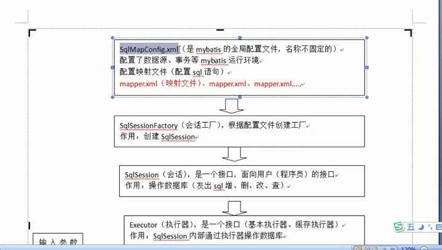
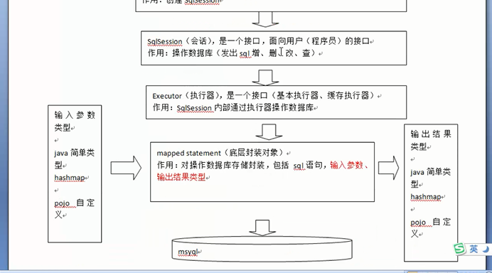
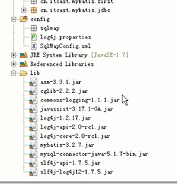
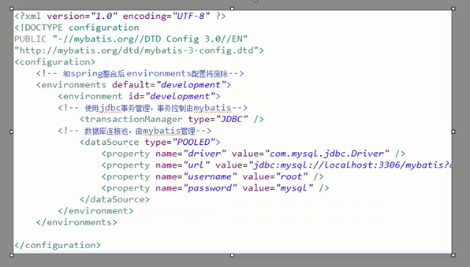
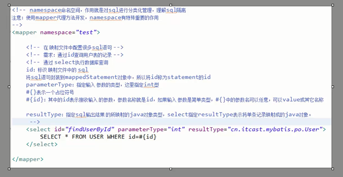
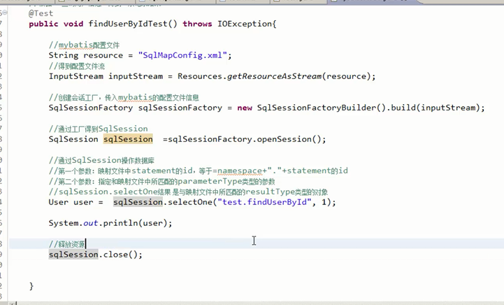
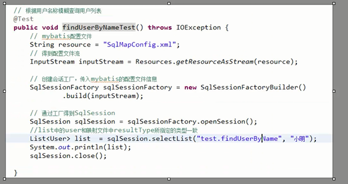

## JDBC 问题

* 注意
> connection  prepareStament  ResultSet  
> 释放的时候倒着释放

1. 数据库连接，使用时创建，不用时立即释放，对数据库进行频繁开启和关闭，造成数据库资源浪费， 影响数据库性能。
> 设想： 使用数据库连接池管理数据库连接

2. 将SQL语句<strong>硬编码</strong>到java代码中，如果sql语句修改，需要重新编译java代码，不利于系统维护。
> 将SQL语句配置在xml配置文件中，即使SQL变化，不需要对java代码进行重新编译。

3. 向prepareStatement中设置参数，对占位符位置和设置参数值，硬编码在java代码中，不利于系统维护。
> 将SQL语句及占位符和参数全部配置在xml中。

4. 从ResultSet中遍历结果集数据时，存在硬编码，将获取表的字段进行硬编码，不利于系统维护。
> 设想： 将查询的结果集，自动映射成JAVA对象。

# mybatis是什么？

* mybatis是一个持久化的框架，是apache下的顶级项目。

* mybatis托管到goolecode下，在后来托管到github下

* mybatis 让程序将主要精力放在sql上，通过mybatis提供的映射方式，自由灵活生成（半自动化，大部分需要程序员自己编写sql）满足需要的sql语句。      

* mybatis 可以将向preparedStatement中的输入参数自动进行输入映射，将查询结果，灵活映射成java对象（输出映射）

>  MyBatis 是支持普通 SQL查询，存储过程和高级映射的优秀持久层框架。MyBatis 消除了几乎所有的JDBC代码和参数的手工设置以及结果集的检索。MyBatis 使用简单的 XML或注解用于配置和原始映射，将接口和 Java 的POJOs（Plain Old Java Objects，普通的 Java对象）映射成数据库中的记录。

# 入门程序

*  mybatis文件下有Lib,lib下装的是依赖包，其中有log4jjar包，因此，要设置一下日志文件  ，即  log4j.properties .

* log4j.properties 设置级别为debug,不能设置为info
* 入门工程结构

#根据用户id来查询用户信息

* 配置SqlMapConfig.xml文件

* 创建pojo类

> pojo类的特点：
私有属性，部分或全部的属性的getter和setter方法，没有业务方法，可以没有无参构造器。它的出现是为了更方便的使用数据库中的表。

## 映射文件

* 映射文件文件名命名： User.xml(原始ibatis命名)，mapper代理开发映射文件名称叫做  xxxMapper.xml,......UserMapper.xml

* 在映射文件中配置sql

* 在sqlmapconfig.xml中加载映射文件

* 根据Id查询，所得结果映射成一个pojo类，现在查询到的是一条结果

* 根据name进行模糊查询
> 配置文件

# 小结

## parameterType ResultType

			parameterType   指的是输入类型
			ResultType      指的是输出类型

## #{} 和  ${}的区别

			#{} 指的是占位符
			${} 指的是拼接符   会引起sql语句的注入

## selectOne  与selectList  的区别

			selectOne  查询的结果有一条，将这一个结果进行映射，可以用selectList去接收
				
			selectList  查询的结果有多条，不可以用selectOne