# 学习安排

* 对订单商品数据模型进行分析

* 高级映射

     1. 实现一对一查询，一对多查询，多对多查询
     2. 延迟加载

* 查询缓存

    1. 一级缓存
    2. 二级缓存（了解Mybatis二级缓存使用场景）

* mybatis和spring整合（掌握）

       逆向工程

# 一对一查询

*  需求
> 查询订单信息，关联查询创建订单的用户信息。

##  resultType

* sql语句
  1. 确定查询的主表
  2. 确定查询的关联表
       关联查询使用内连接还是外连接
		由于orders表中有一个外键（user_id）,通过外键关联查询用户表只能查询出一条记录，可以使用内连接

		select orders.*.
		user.username,
        user.sex,
        user.address
        from orders,user
        where orders.user_id = user.id;

* 创建pojo

> 将上边查询的结果集映射到pojo中，其中必须要包括所有的查询列名。  
> 原始的orders.java不能映射全部字段，需要新创建的pojo。  
> 创建一个pojo继承包括查询字段较多的po类。

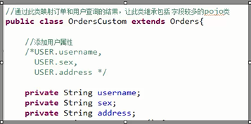

* mapper.xml
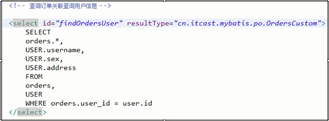

* mapper.java	
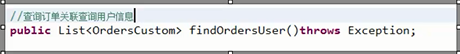

## resultMap

* sql语句
> 同resultType实现的sql

* 使用resultMap映射的思路

> 使用resultMap将查询结果中的订单信息映射到Orders对象中，在orders类中添加user属性，将关联查询出来的用户信息映射到orders对象中的user属性中  
> 需要orders类中添加user属性

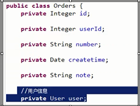

* resultMap的定义

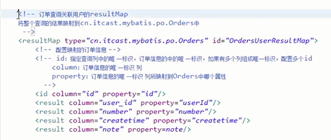

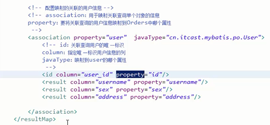

* mapper.xml
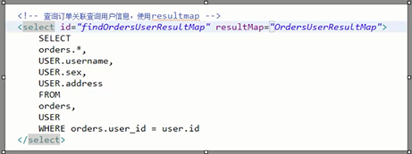

* mapper.java

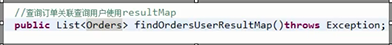

## resultType 和resultMap实现一对一查询小

1. resultType: 使用resultType实现较为简单，如果pojo没有查询出来的列名，需要增加列名对应的属性，即可完成映射。
2. 如果没有查询结果的特殊要求建议使用resultType.

3. resultMap:需要单独定义resultMap,实现有点麻烦，如果对查询结果有特殊的要求，使用resultMap可以完成将关联查询映射pojo的属性中。
4. resultMap可以实现延迟加载，resultType无法实现延迟加载。

# 一对多查询

* 需求
> 查询订单及订单明细的信息

* sql语句

> 确定主查询表：订单表  
> 确定关联查询表：订单明细表  
> 在一对一查询基础上添加订单明细表即可。  

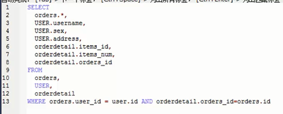

查询结果：  
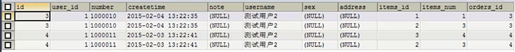  
因为一个订单对应多个订单明细，所以会出现订单信息重复的情况。

* 分析
> 使用resultType将上边的查询结果映射到pojo中，订单信息就会重复。

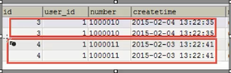

要求：  
对orders映射不能出现重复记录  
在orders.java类中添加List<orderDetail> orderDetails属性。  
最终会将订单信息映射到orders中，订单所对应的订单明细映射到orders中的orderDetails属性中。  

映射成的orders记录数为两条（对于以上查询结果）  
每个orders中的orderDetails属性存储了该订单所对应的订单明细。  

* 在orders中添加list订单明细属性
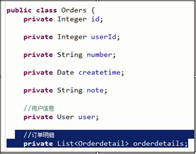

* mapper.xml

sql 语句修改为下面：  
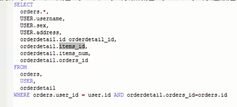

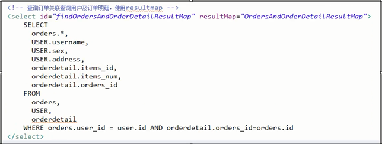

* resultMap的定义
针对的是主表order   

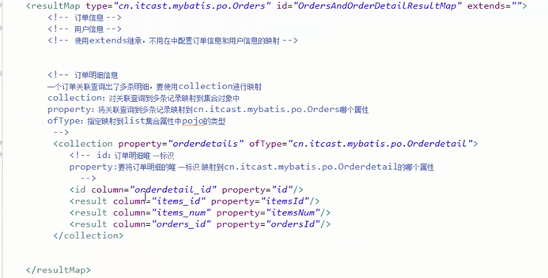

* mapper.java 

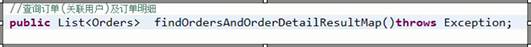
  

* 小结
> mybatis使用collection对关联查询的多条记录映射到一个list属性结合中。  
> 使用resultType实现  
> 将订单明细映射到orders中的orderDetail中，需要自己处理，使用双重循环遍历，去掉重复记录，将订单明细放在orderDetails中。

# 多对多查询

* 需求
>  查询用户及用户购买信息。

* sql语句

查询主表是：用户表  
关联表： 由于用户和商品之间没有直接关联，通过订单和订单明细进行关联，所以关联表：orders,orderDetails,items

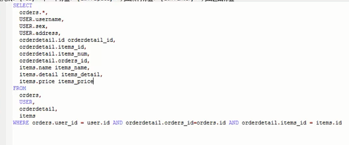

查询结果：  
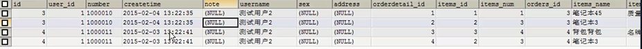

 * 映射思路

1. 将用户信息映射到user中
2. 在user类中添加订单列表属性List<Orders> orderlist,将用户创建的订单映射到orderlist.
3. 在orders中添加订单明细列表属性List<OrderDetails> orderDetails ,将订单的明细映射到orderDetails.
4. 在OrderDetail中添加items属性，将订单明细所对应的商品映射到items.

* mapper.xml

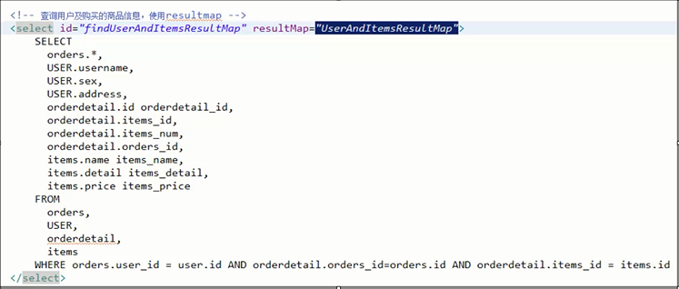

* resultMap定义

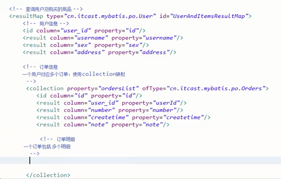

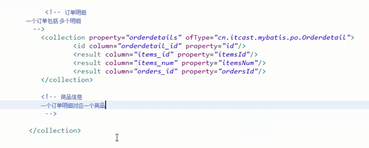

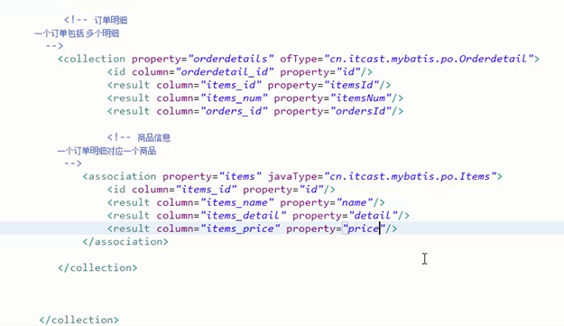

* mapper.java

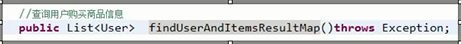 

## 多对多查询总结

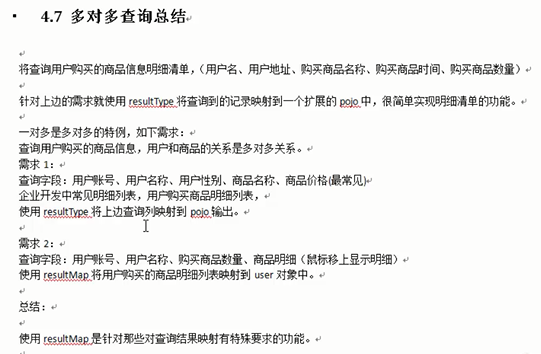

使用resultMap是针对那些对查询结果映射有特殊要求的功能，比如要求映射成List中包括多个list

 

 

