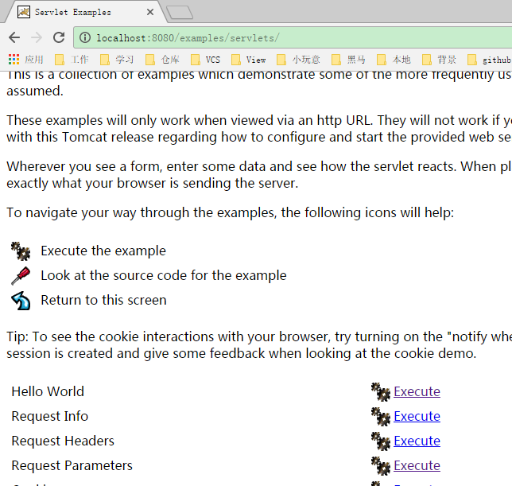
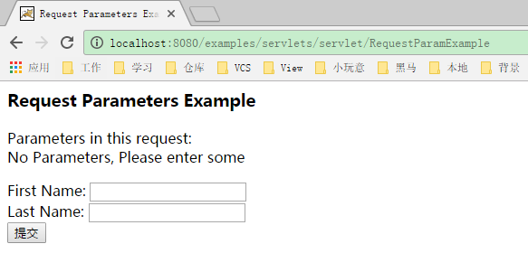

# http协议&Servlet

## http协议
* 什么是协议

> 双方在交互，通讯的时候，遵守的一种规范。

* http协议

> 针对网络上的客户端  与  服务器端 在执行http请求的时候，遵守的一种规范，其实就是规定了客户端在访问服务器端的时候，要带上哪些东西，服务器端返回数据的时候，也要带上什么东西

* 版本

         1.0 请求数据，服务器返回后，将会断开连接 
		 1.1  
				请求数据，服务器端返回后，连接还会保持着，除非服务器或者客户端关掉，有一定的时间限制，如果都空着这个连接，那么后面会自己断掉

### 演示客户端  如何  与服务器端通讯

>在地址栏里输入网络地址 回车   或者是平常注册的时候，点了注册按钮 ，浏览器都能显示出来一些东西，那么背地里到底浏览器和服务器怎么通讯。他们都传输了哪些数据。

1. 安装抓包工具 HttpWatch(IE插件)
2. 打开tomcat,输入localhost:8080
3. 在首页上找到Example
4. 选择servlet例子 ---> Request Parameter

接着点击Request  Parameters 的Execute超链接

执行tomcat的例子，然后查看浏览器和tomcat服务器的对接细节

###Http请求数据解释 

> 请求的数据里面包含三个部分内容 ： 请求行 、 请求头 、请求体

* 请求行

		POST /examples/servlets/servlet/RequestParamExample HTTP/1.1 

		POST ： 请求方式 ，以post去提交数据
			
		/examples/servlets/servlet/RequestParamExample
		请求的地址路径 ， 就是要访问哪个地方。
	
		HTTP/1.1 协议版本

* 请求头

		Accept: application/x-ms-application, image/jpeg, application/xaml+xml, image/gif, image/pjpeg, application/x-ms-xbap, */*
		Referer: http://localhost:8080/examples/servlets/servlet/RequestParamExample
		Accept-Language: zh-CN
		User-Agent: Mozilla/4.0 (compatible; MSIE 8.0; Windows NT 6.1; WOW64; Trident/4.0; SLCC2; .NET CLR 2.0.50727; .NET CLR 3.5.30729; .NET CLR 3.0.30729; Media Center PC 6.0; .NET4.0C; .NET4.0E)
		Content-Type: application/x-www-form-urlencoded
		Accept-Encoding: gzip, deflate
		Host: localhost:8080
		Content-Length: 31
		Connection: Keep-Alive
		Cache-Control: no-cache

		Accept: 客户端向服务器端表示，我能支持什么类型的数据。 
		Referer ： 真正请求的地址路径，全路径
		Accept-Language: 支持语言格式
		User-Agent: 用户代理 向服务器表明，当前来访的客户端信息。 
		Content-Type： 提交的数据类型。经过urlencoding编码的form表单的数据
		Accept-Encoding： gzip, deflate ： 压缩算法 。 
		Host ： 主机地址
		Content-Length： 数据长度
		Connection : Keep-Alive 保持连接
		Cache-Control ： 对缓存的操作

* 请求体

>浏览器真正发送给服务器的数据 
	
		发送的数据呈现的是key=value ,如果存在多个数据，那么使用 &

		firstname=zhang&lastname=sansan

###Http响应数据解析

> 请求的数据里面包含三个部分内容 ： 响应行 、 响应头 、响应体

	HTTP/1.1 200 OK
	Server: Apache-Coyote/1.1
	Content-Type: text/html;charset=ISO-8859-1
	Content-Length: 673
	Date: Fri, 17 Feb 2017 02:53:02 GMT

	...这里还有很多数据...

* 响应行
	
		HTTP/1.1 200 OK

		协议版本  

		状态码 

			咱们这次交互到底是什么样结果的一个code. 
		
			200 : 成功，正常处理，得到数据。
	
			403  : for bidden  拒绝
			404 ： Not Found
			500 ： 服务器异常

		OK

			对应前面的状态码  

* 响应头

		Server:  服务器是哪一种类型。  Tomcat
	
		Content-Type ： 服务器返回给客户端你的内容类型

		Content-Length ： 返回的数据长度

		Date ： 通讯的日期，响应的时间		

##Get 和  Post请求区别

* post

		1. 数据是以流的方式写过去，不会在地址栏上面显示。  现在一般提交数据到服务器使用的都是POST
	
		2. 以流的方式写数据，所以数据没有大小限制。

* get

		1. 会在地址栏后面拼接数据，所以有安全隐患。 一般从服务器获取数据，并且客户端也不用提交上面数据的时候，可以使用GET
	
		2. 能够带的数据有限， 1kb大小

###Web资源

在http协议当中，规定了请求和响应双方， 客户端和服务器端。与web相关的资源。 

有两种分类

* 静态资源

	html 、 js、 css

* 动态资源

	servlet/jsp

### 安装tomcat(是一个servlet容器)
> servlet容器其实是一个简单web服务器来使用

1. 将tomcat压缩文件解压到/home/soft01/opt/apache-tomcat5.5.23.tar.gz
2. 配置环境变量
3. 启动tomcat
>  cd /home/soft01/apache-tomcat/bin  
> sh startup.sh或者sh catalina.sh run  
> 接下来，可以打开浏览器，输入http://localhost:8080  
> 如果要关闭tomcat,可以使用  
> cd /home/soft01/apache-tomcat/bin   
> sh shutdown.sh
### servlet是什么？
> &emsp;其实是一个java程序，运行在web服务器上，用于接收和响应客户端的http请求  
> &emsp;更多是配合动态资源来做，当然，静态资源也需要使用到servlet,只不过Tomcat里面已经定义好了一个DefaultServlet.
### 如何写一个servlet(记事本)
1. 先写一个java类，实现Servlet接口或者继承HttpServlet抽象类
2. 编译
3. 打包  
 
        即创建一个具有如下结构的文件夹
			appname(应用名)
			    WEB-INF
				   classes(.class文件)
				   lib(.jar文件，可选)
				   web.xml(部署描述文件url-pattarn)

4. 部署  
   
         将第三步创建的文件夹拷贝到servlet容器特定的文件夹下面
attention: 也可以将第三步创建的文件夹使用jar命令进行压缩，生成.war为后缀的文件，然后拷贝。
5. 启动servlet容器，访问servlet
     
         http://ip:port/appname/url-pattern(url-pattarn描述如何访问servlet)

### Hello Servlet
1. 写一个web工程，要有一个服务器
2. 配置Servlet, 告诉服务器，我们的应用有这么些个servlet

          在webContent/WEB-INF/web,xml里面下写如下内容。
				<?xml version="1.0" encoding="UTF-8"?>
				<web-app xmlns:xsi="http://www.w3.org/2001/XMLSchema-instance" xmlns="http://xmlns.jcp.org/xml/ns/javaee" xsi:schemaLocation="http://xmlns.jcp.org/xml/ns/javaee http://xmlns.jcp.org/xml/ns/javaee/web-app_4_0.xsd" id="WebApp_ID" version="4.0">
						//向tomcat报告，我们的应用有一个叫做HelloWord的servlet,路径为web.WebPrac(即包名.类名)		
				 <servlet>
				        <servlet-name>HelloWord</servlet-name>
				        <servlet-class>web.WebPrac</servlet-class>
				    </servlet>
						//注册servlet的映射，url-pattern，访问的形式，通过servlet的名字找到路径
				 <servlet-mapping>
				        <servlet-name>HelloWord</servlet-name>
				        <url-pattern>/HelloWord</url-pattern>
				    </servlet-mapping>
				
				</web-app>
3. 地址栏输入http://localhost:8080/项目名称/url-pattern
### servlet的执行过程
1. 找到tomcat应用（localhost:8080）
2. 找到项目
3. 找到web.xml,然后在里面找到url-pattern
4. 找到servlet-mapping中的servlet-name[HelloWord]
5. 找到上面定义的servlet元素中的servlet-name中的【HelloWord】
6. 找到下面定义的servlet-class，然后开始创建类的实例
7. 继而执行servlet中的service方法。
### servlet的通用写法
         
 				servlet（接口）
				   |
				   |
			  GenericServlet
			       |
				   |
			   HttpServlet(用于处理http请求)
1. 定义一个类，继承HttpServlet,重写doGet(),doPost().
        
###servlet的生命周期
* 生命周期
> 从创建到销毁的一段时间
* 生命周期方法
> 从创建到销毁，所调用的那些方法

* init()方法

			//在创建该servlet实例时,就执行该方法
				//一个servet方法只会初始化一次，init()只会执行一次
				//默认情况下：初次访问servlet,才会创建它的实例
				@Override
				public void init(ServletConfig arg0) throws ServletException {
					System.out.println("init----");
				}
* service()方法

			//执行客户端的请求
				//该方法可以被执行很多次，一次请求对应一次该方法的执行
				@Override
				public void service(ServletRequest arg0, ServletResponse arg1) throws ServletException, IOException {
					System.out.println("service---");
					
				}
* destory()方法

			//servlet销毁的时候，执行该方法
				@Override
				public void destroy() {
					System.out.println("destroy---");
					
				}
			1. 该项目从tomcat里面移除
			2. 正常关闭tomcat，（shutdown.bat）
> doGet 和doPost方法不算生命周期方法。生命周期方法指的是，从对象的创建到销毁一定会执行的方法，但是这俩个方法，不一定会执行。
### 让servlet创建实例的时机提前
1. 默认情况下，只有在初次访问servlet的时候，才会执行init方法，有的时候，可能需要在这个方法里执行一些初始化工作，甚至做一些比较耗时的逻辑。
2. 那么这个时候，初次访问，可能会在init方法里停留太长的时间，得想办法让这个初始化提前一点。
3. 在配置的时候，使用load-on-startup元素来指定，给定的数字越小，启动的时机就越早，一般不写负数，从2开始即可

					<servlet>
					<servlet-name>HelloWorld</servlet-name>
					<servlet-class>web.HelloServlet01</servlet-class>
					<load-on-startup>2</load-on-startup>
					</servlet>
## ServletConfig
> Servlet的配置 通过该对象，可以获取servlet在配置时候的一些信息

---
			@Override
				protected void doGet(HttpServletRequest req, HttpServletResponse resp) 
						throws ServletException, IOException {
					//创建ServletConfig对象
					ServletConfig config = getServletConfig();
					//通过参数称获取参数的值
					String parameter = config.getInitParameter("name");
					System.out.println(parameter);
					//获取所有的参数名称
					Enumeration<String> names = config.getInitParameterNames();
					while(names.hasMoreElements()) {
						String name = names.nextElement();
						
						String value = config.getInitParameter(name);
						System.out.println("name = "+name+" value = "+value);
					}
				}

---
					<servlet>
					<servlet-name>HelloServlet02</servlet-name>
					<servlet-class>web.HelloServlet02</servlet-class>
					<init-param>
					<param-name>name</param-name>
					<param-value>jinfeihu</param-value>
					</init-param>
					<init-param>
					<param-name>age</param-name>
					<param-value>19</param-value>
					</init-param>
					</servlet>
					<servlet-mapping>
					<servlet-name>HelloServlet02</servlet-name>
					<url-pattern>/HelloServlet02</url-pattern>
					</servlet-mapping>
### 为什么需要ServletConfig
1. 未来我们自己开发一些应用，使用到一些技术，或者一些代码，但是有人写出来了，它的代码放置在了自己的Servlet类里面了。
2. 刚好这个Servlet里面需要一个数字，或者变量，但是这个值不能是固定的。所以要求使用这个Servlet的公司，在注册Servlet的时候，必须在web.xml里面，声明init-params.  
(在开发当中很少用)

## 总结
* http协议

             1. 使用HttpWacht抓包看一看http请求背后的细节
             2. 基本了解  请求和响应的数据内容
		             请求行   请求头    请求体
					 响应行   响应头   响应体
			 3. Get和Post的区别
			 
*Servlet

             1. 使用简单的Servlet
             
                     1. 写一个简单的类实现接口Servlet
                     2. 配置Servlet
                     3. 会访问Servlet
                     
			 2.  Servlet的生命周期
			 	 init()  一次  创建对象   默认初次访问就会调用或者可以通过配置，让它提前load-on-startup
				 service()  多次，一次请求对应一次service
				 destroy() 一次  销毁的时候   从服务器移除  或者 正常关闭服务器
   			 3. ServletConfig
   			      获取配置的信息，params
	 