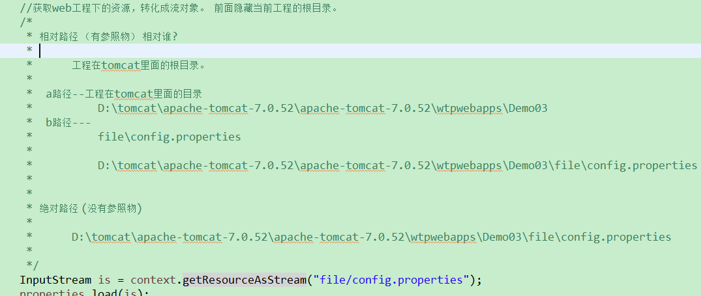
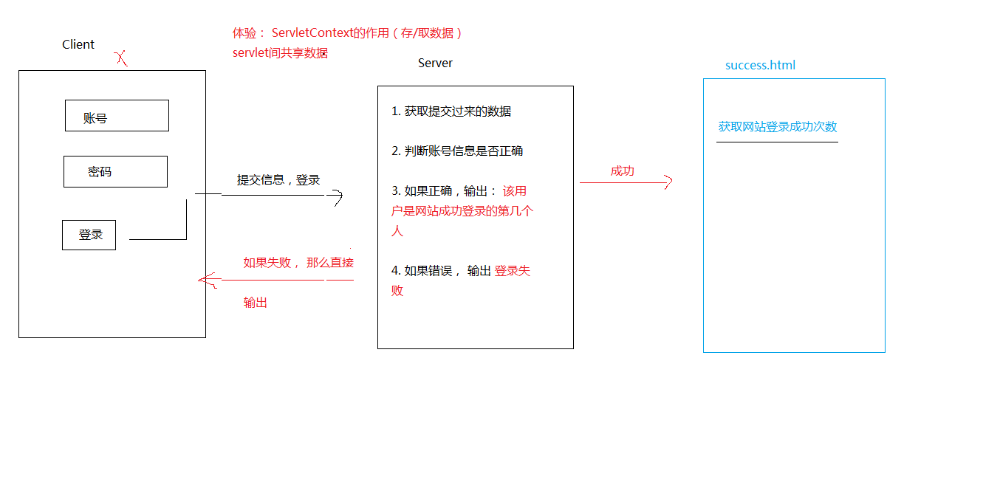
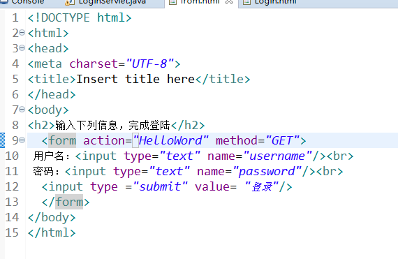
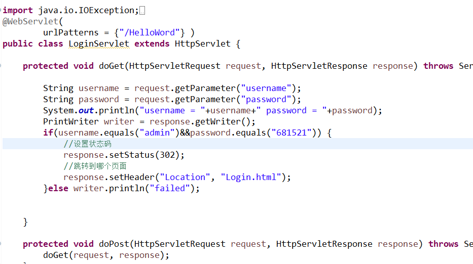
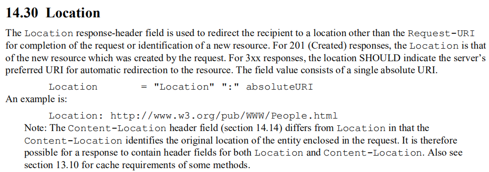
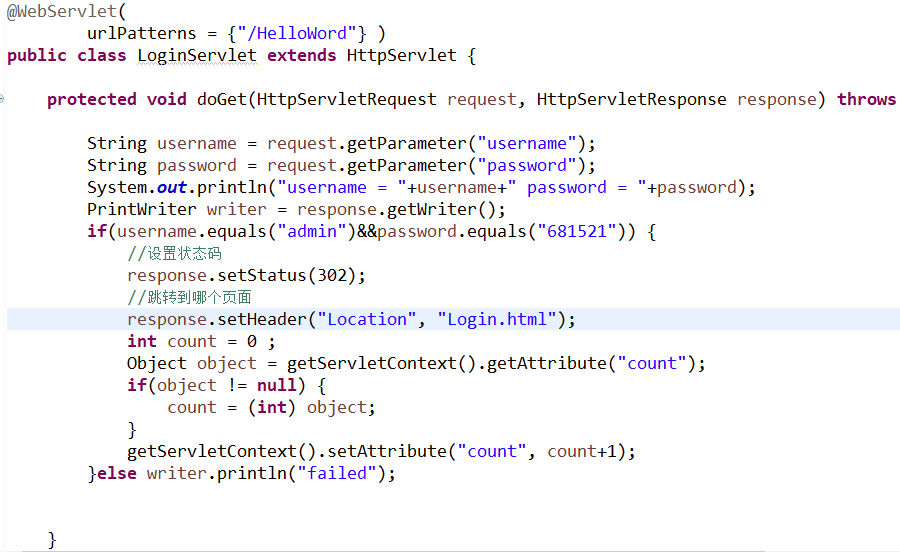
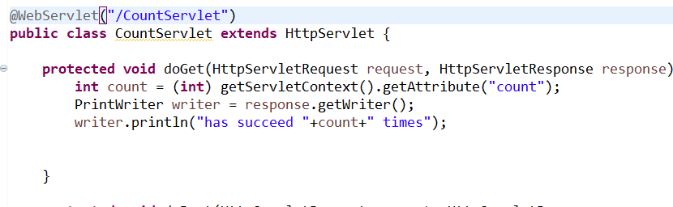

## HttpServletRequest && HttpServletResponse

###Servlet配置方式

* 1. 全路径匹配

> 以 / 开始   eg. /a &emsp;    /aa  &emsp;  /ab
> locahost:8080/项目名称/aa/bb

* 2. 路径匹配，前半段匹配

> 以 / 开始 ， 但是以 * 结束   &emsp;  /a/* &emsp; /*
> &emsp;* 是一个通配符，匹配任意文字
> localhost:8080/项目名称/aaxvd

* 3. 以扩展名形式匹配
> 没有/ 以*开始    *.aa&emsp;  *.bb

### ServletContext
> Servlet 上下文
> 每个web工程都只有一个ServletContext对象。即不管在哪个Servlet里面，获取到的ServletContext对象都是同一个。

### 如何得到对象

	   //获取对象
			ServletContext context = getServletContext();
			
###作用
#### 1.可以获取全局配置参数（getInitParameter（））

		<!-- 全局参数  任意一个Servlet都可以拿 -->
		 <context-param>
		 <param-name>name</param-name>
		 <param-value>我家大王</param-value>
		 </context-param>

代码:

		protected void doGet(HttpServletRequest req, HttpServletResponse resp) 
					throws ServletException, IOException {
				//获取对象
				ServletContext context = getServletContext();
				//根据name 获取value
				String parameter = context.getInitParameter("name");
				System.out.println("name = "+parameter);
			}
####  2 .可以获取web应用中的资源（getRealPath（））

			1. 获取资源在tomcat里面的绝对路径
			     ServletContext context = getServletContext();
		  String path = context.getRealPath("");//得到项目在tomcat里面的根目录
		===>  D:\apache-tomcat-9.0.13\wtpwebapps\webProject\

			protected void doGet(HttpServletRequest req, HttpServletResponse resp) 
					throws ServletException, IOException {
				ServletContext context = getServletContext();
				String path = context.getRealPath("file/web.properties");
				System.out.println(path);
				//1.创建properties对象
				Properties pro = new  Properties();
				//2.获取输入流并且加载资源
				InputStream  in = new  FileInputStream(path);
				pro.load(in);
				//3. 获取属性值
				String value = pro.getProperty("name");
				System.out.println("his name = "+value);
		}
				结果：
			D:\apache-tomcat-9.0.13\wtpwebapps\webProject\file\web.properties
			his name = wojiaaifei

		2. getResourceAsStream 获取资源 流对象

		        直接给相对的路径，然后获取流对象。

 

* 3.通过classLoader去获取web工程下的资源

			 URL stream = this.getClass().getClassLoader().getResource("");
				System.out.println(stream);	

			class文件的路径： file:/D:/apache-tomcat-9.0.13/wtpwebapps/webProject/WEB-INF/classes/

---

				URL stream = this.getClass().getClassLoader().getResource("../../");//回到上上级目录
					System.out.println(stream);	

			工程的根目录：file:/D:/apache-tomcat-9.0.13/wtpwebapps/webProject/

---

                URL stream = this.getClass().getClassLoader().getResource("../../file/web.properties");
	                   System.out.println(stream);	

				找到资源文件的路径：file:/D:/apache-tomcat-9.0.13/wtpwebapps/webProject/file/web.properties

---
---

整体代码：

						protected void doGet(HttpServletRequest req, HttpServletResponse resp) 
						throws ServletException, IOException {
									
			InputStream stream = this.getClass().getClassLoader().getResource("../../file/web.properties").openStream();
			
          //   InputStream stream = this.getClass().getClassLoader().getResourceAsStream("../../file/web.properties");
					 
				//1.创建properties对象
				Properties pro = new  Properties();
			 //2.获取输入流并且加载资源
				pro.load(stream);
			//3. 获取属性值
				String value = pro.getProperty("name");
				System.out.println("his name = "+value);
	}
####3.ServletContext存取数据

> request 包含客户端请求的信息  
> response 反馈客户端的请求  

1. 需求

2. 建立一个HTML文件，该页面用于登录 

3. 建立一个LoginServlet类作为服务器端响应客户端,判断账号密码的正误跳转到不一样的页面

###  1. Status Code Definitions  HTTP状态代码定义(普及)
1. 消息1xx（informational 1xx）
> 该类代码表示临时回应

2. 成功2xx(Successful 2xx)
> 表示客服端请求被成功接收，理解，接收

3. 3xx 重定向(Redirection 3xx)
> 表示用户代理要想完成请求，还需要发出进一步的操作

4. 4xx 客户端错误（Client Error 4xx）

5. 服务器错误(Server Error 5xx)
> 表示服务器端发现自己出现错误，不能继续执行请求。

###2.  Location(setHeader(name,value))

###3.  Servlet 注解@webServlet
> 用于将一个类声明为Servlet,该注解将会在部署时被容器处理，容器根据具体的属性配置将相应的类部署为Servlet.其中value属性和urlPatterns属性通常必备，且二者不能共存，如果同时指定，会被忽略掉。

###最终实现

 class LoginServlet
		
		public Object getAttribute(String name)
		返回具有给定名称的 servlet 容器属性，如果不具有该名称的属性，则返回 null。属性允许 servlet 容器将此接口还没有提供的额外信息提供给 servlet。
	    public void setAttribute(String name, Object object)
		将对象绑定到此 servlet 上下文中的给定属性名称。如果已将指定名称用于某个属性，则此方法将使用新属性替换具有该名称的属性。
 

class CountServlet

login.html

				<!DOCTYPE html>
				<html>
				<head>
				<meta charset="UTF-8">
				<title>Insert title here</title>
				</head>
				<body>
				<a href = "CountServlet">succeed times</a>
				</body>
				</html>
##细节

				<!-- 	
				A路径： Servlet的路径
					http://localhost:8080/Demo4/login
				
				B路径： 当前这个html的路径：
					http://localhost:8080/Demo4/login.html -->
				
				A B处于同一个根目录下
				<form action="login" method="get">
					账号:<input type="text" name="username"/> 
					密码:<input type="text" name="password"/> 
					<input type="submit" value="登录"/>
				</form>
###ServletContext 何时创建， 何时销毁?

服务器启动的时候，会为托管的每一个web应用程序，创建一个ServletContext对象

从服务器移除托管，或者是关闭服务器。 

* ServletContext 的作用范围

> 只要在这个项目里面，都可以取。 只要同一个项目。 A项目 存， 在B项目取，是取不到的？ ServletContext对象不同。

##HttpServletRequest
> 这个对象封装了客户端提交过来的一切数据。

1. 获取请求头

			Enumeration<String> names = req.getHeaderNames();
					while(names.hasMoreElements()) {
						String element = names.nextElement();
						String header = req.getHeader(element);
						System.out.println(element + "=" + header);
					}

			host=localhost:8080
			connection=keep-alive
			upgrade-insecure-requests=1
			user-agent=Mozilla/5.0 (Windows NT 10.0; WOW64) AppleWebKit/537.36 (KHTML, like Gecko) Chrome/71.0.3578.98 Safari/537.36
			accept=text/html,application/xhtml+xml,application/xml;q=0.9,image/webp,image/apng,*/*;q=0.8
			accept-encoding=gzip, deflate, br
			accept-language=zh-CN,zh;q=0.9
			cookie=Hm_lvt_668f5751b331d2a1eec31f2dc0253443=1548309031
			
2. 获取客户端提交的数据

				//  1. 通过属性名获取值
						String name = req.getParameter("name");
						System.out.println(name);
						 //  2. 获取属性与值的map集合
				        	Map<String, String[]> map = req.getParameterMap();
				        	Set<String> set = map.keySet();
				        	Iterator<String> iterator = set.iterator();
				        	while(iterator.hasNext()) {
				        		String nama = iterator.next();
				        		String value = map.get(nama)[0];
				        		System.out.println(nama+" == "+value);
				        	}
				        	
				        	// 3. 获取属性的枚举集合
				        	Enumeration<String> names = req.getParameterNames();
				        	while(names.hasMoreElements()) {
				        		String element = names.nextElement();
				        		String value1 = req.getParameter(element);
				        		System.out.println(element+" ===="+value1);
				        	}

3. 获取中文数据

> 客户端提交数据给服务器端，如果数据中带有中文的话，有可能会出现乱码情况，那么可以参照以下方法解决。
> 谷歌浏览器get方式不会乱码，post方式会乱码

* 如果是GET方式
	
	1. 代码转码
			String username = request.getParameter("username");
			String password = request.getParameter("password");
			
			System.out.println("userName="+username+"==password="+password);
			
			//get请求过来的数据，在url地址栏上就已经经过编码了，所以我们取到的就是乱码，
			//tomcat收到了这批数据，getParameter 默认使用ISO-8859-1去解码
			
			//先让文字回到ISO-8859-1对应的字节数组 ， 然后再按utf-8组拼字符串
			username = new String(username.getBytes("ISO-8859-1") , "UTF-8");
			System.out.println("userName="+username+"==password="+password);
		
			直接在tomcat里面做配置，以后get请求过来的数据永远都是用UTF-8编码。 
	

	2. 可以在tomcat里面做设置处理 conf/server.xml 加上URIEncoding="utf-8"
 
		  <Connector connectionTimeout="20000" port="8080" protocol="HTTP/1.1" redirectPort="8443" URIEncoding="UTF-8"/>
* 如果是POST方式

		这个说的是设置请求体里面的文字编码。  get方式，用这行，有用吗？ ---> 没用
		request.setCharacterEncoding("UTF-8");
	
		这行设置一定要写在getParameter之前。
##HttpServletResponse

> 负责返回数据给客户端。 

* 输出数据到页面上

		//以字符流的方式写数据	
		//response.getWriter().write("<h1>hello response...</h1>");
		
		//以字节流的方式写数据 
		response.getOutputStream().write("hello response2222...".getBytes());

### 响应的数据中有中文，那么有可能出现中文乱码

* 以字符流输出

> response.getWriter()

		//1. 指定输出到客户端的时候，这些文字使用UTF-8编码
		response.setCharacterEncoding("UTF-8");
		
		//2. 直接规定浏览器看这份数据的时候，使用什么编码来看。
		response.setHeader("Content-Type", "text/html; charset=UTF-8");
		
		response.getWriter().write("我爱黑马训练营...");

* 以字节流输出 

> response.getOutputStream()

	
		
		//1. 指定浏览器看这份数据使用的码表
		response.setHeader("Content-Type", "text/html;charset=UTF-8");
		
		//2. 指定输出的中文用的码表
		response.getOutputStream().write("我爱深圳黑马训练营..".getBytes("UTF-8"));

		--------------------------------------------

###不管是字节流还是字符流，直接使用一行代码就可以了。

	response.setContentType("text/html;charset=UTF-8");

	然后在写数据即可。
        	