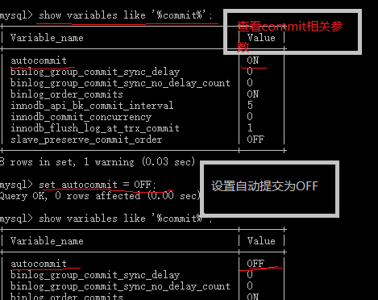
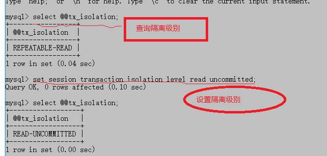
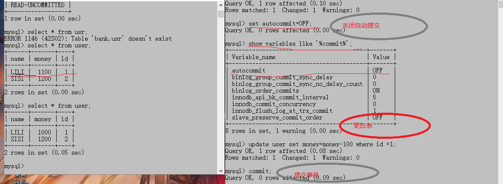
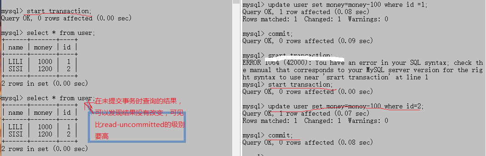
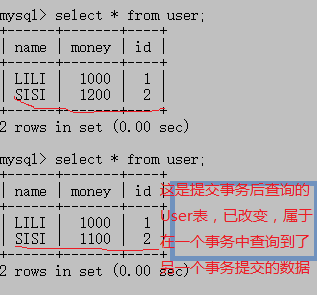
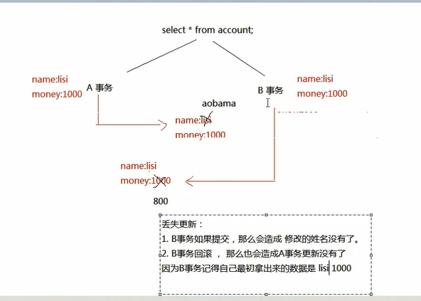
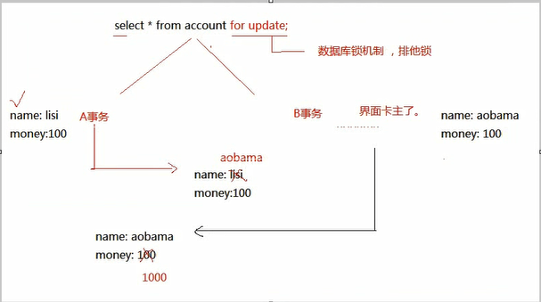
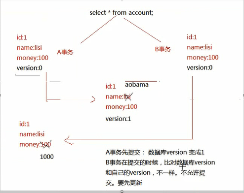
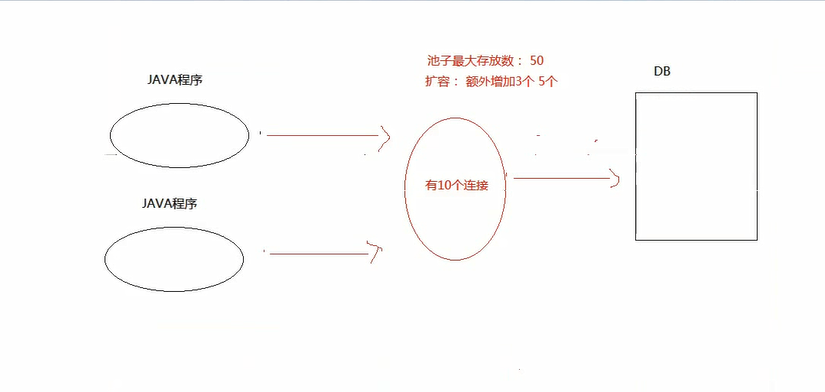

# 事务&数据库连接池&DBUtils

## 事务

> Transaction  其实指的是一组操作 ， 里面包含许多单一的逻辑，只要有一个没有执行成功，那就算是执行失败，所有的数据都会回归到最初的状态（回滚）

> 为什么要有事务？、

> 为了确保逻辑的成功。  例子： 银行的转账

* 假如正在取钱，过程中突然停电，钱还没有取出来，则账户不减钱。

# 使用命令行方式演示事务

## 关闭自动提交功能

		
		commit;  事务提交（提交事务后该次事务结束，提交后数据库才会更新）
			数据将会写到磁盘上的数据库
		start transaction;  打开事务
		rollback;      回滚 （也可表示事务的结束，逻辑没有全部通过）

# 使用代码演示事务
	
			@Test
	  	 public void test() {
			Connection conn =null;
		   try {
			 conn = JDBCclose.getConn();
			//设置不能自动提交
			conn.setAutoCommit(false);
			   String sql = "update user set money=money-? where id=?" ;
			   PreparedStatement ps = conn.prepareStatement(sql);
			   ps.setInt(1, 100);
			   ps.setInt(2, 1);
			   ps.executeUpdate();
				// 到下面一句出现异常
			    int a = 10/0; 
				// 调到Try语句块当中
			   ps.setInt(1, -100);
			  ps.setInt(2, 2);
			  ps.executeUpdate();
				// 事务提交
			  conn.commit();
		} catch (SQLException e) {
			 //事务回滚
			try {
				conn.rollback();
			} catch (SQLException e1) {
				e1.printStackTrace();
			}
			e.printStackTrace();
		}
	   }

* 在没有提交事务之前，数据库的数据不变，所以回滚时数据库里面的数据并没有改变

## 事务的特性（ACID）

* 原子性

> 指的是  事务中包含的逻辑，不可分割

* 一致性

> 指的是 事务执行前后，数据的完整性

* 隔离性

> 指的是  事务在执行期间不应该受到其他事务的影响

* 持久性

> 指的是  事务执行成功，那么数据应该持久保存到磁盘上。

## 事务的安全隐患

> 不考虑隔离级别设置 ， 那么会出现以下问题

1.  读

> 脏读  不可重复读  幻读

*  脏读
  > 一个事务读到另外一个事务还未提交的数据
 
* 不可重复读
  > 一个事务查询到了另一个事务提交的数据

* 可重复读
  > 不受另一个事务的影响，不管它提交事务或者不提交，该事务查询的结果都一样。

* 幻读
> 一个事务读到了另一个事务insert的数据。
### 读未提交演示
设置A窗口的隔离级别

两个窗口开启事务

B窗口关闭自动提交  
修改user表但不提交，然后用A窗口查询user表，发现已经读取未提交的事务，但是在数据库中并没有改变。  
当B窗口提交事务后，数据库中才改变。

* 写

> 丢失更新

### 读已提交演示

AB窗口都开启事务，设置A窗口的隔离级别

B窗口中修改user表，在不提交的情况下在A窗口查询user，然后在提交事务后在A窗口中查询user;

查询结果不一致，该隔离级别可以屏蔽脏读的现象，但是引发了另一个问题不可重复读。

## 可串行化

> 如果有一个连接的隔离级别设置了串行化，那么谁先打开了事务，谁就有了先执行的权利，谁后打开事务，谁就只能等着，等前面那个事务，提交或者回滚，才能执行。但是这一种隔离级别比较少用，容易造成性能上的问题，效率比较低。

* 按效率划分，从高到低。

读未提交 > 读已提交  >  可重复读  > 可串行化

* 按拦截程度，从高到低

> 可串行化 > 可重复读  > 读已提交   >  读未提交  

# 事务的总结

1. 在代码里面会使用事务

			conn.setAutoCommit(false);
			conn.commit();
			conn,rollback;

2. 事务只是针对连接对象，如果再开一个连接对象 ，那么那是默认的提交。

3. 事务是会自动提交的。

## 需要了解的

### 安全隐患

		读
			脏读
				一个事务读到了另一个事务未提交的数据
			不可重复读
				一个事务读到了另一个事务已经提交的数据，造成两次查询结果不一致
			幻读
				一个事务读到了另一个事务insert的数据。

	 写

### 隔离级别-----解决安全隐患

读未提交
> 引发问题： 脏读

读已提交

> 解决 ： 脏读 引发： 不可重复读

可重复读

> 解决 ： 脏读，不可重复读 ，  未解决 ： 幻读

可串行化
> 解决 : 脏读，不可重复读 ， 幻读。

mysql  默认的隔离级别是  可重复读
Oracle  默认的隔离级别是  读已提交

## 丢失更新（不基于可串行化）

* B事务如果提交，会造成A修改的姓名没有了

* B事务回滚，会造成A事务更新没有了

* 因为B事务始终记得最初拿出来的数据。

## 解决丢失更新

* 悲观锁

> 认为一定会出现丢失更新。可以在查询的时候加入 for update .

* 乐观锁

> version要程序员自己写代码控制

# 数据库连接池

> 1. 数据库的连接对象创建工作 ， 比较消耗性能。

> 2. 一开始先在内存中开辟一块空间（集合） ，往池子里放置多个连接对象，后面需要连接的话，直接从池子里面去拿，不需要自己创建连接。使用完后，要归还连接，确保连接对象能循环利用。

# 自定义数据库连接池

* 代码实现

* 出现的问题

   1. addback是自己定义的方法，在接口中并没有这个方法，需要额外记住

   2. 没有单例，每次创建一个MyDataSource都相当于创建了一个连接池，需要做成单例

   3. 无法面向接口编程。接口中没有自己定义的方法。

		编译的时候看左边 ，运行的时候看右边

## 怎么解决？以addback()为切入点

> 	由于多了一个addback方法，所以使用这个连接池的地方，需要额外记住该方法，并且不能面向接口编程。
>   打算修改接口中的close的 方法，原来的Connection对象的close方法，是真的关闭连接。
>   打算修改这个close方法，以后在调用close方法时，并不是真的关闭，而是归还连接对象。

## 如何扩展某一个方法

> 原有的方法逻辑，不是我们想要的，想修改自己的逻辑

1. 直接修改源码   无法实现

2. 继承，必须直到Connection接口的实现类是谁，才能创建一个类继承该类，重写Connection的close方法。

3. 使用装饰者模式

