# 学习安排

* 对订单商品数据模型进行分析

* 高级映射

     1. 实现一对一查询，一对多查询，多对多查询
     2. 延迟加载

* 查询缓存

    1. 一级缓存
    2. 二级缓存（了解Mybatis二级缓存使用场景）

* mybatis和spring整合（掌握）

       逆向工程

# 一对一查询

*  需求
> 查询订单信息，关联查询创建订单的用户信息。

##  resultType

* sql语句
  1. 确定查询的主表
  2. 确定查询的关联表
       关联查询使用内连接还是外连接
		由于orders表中有一个外键（user_id）,通过外键关联查询用户表只能查询出一条记录，可以使用内连接

		select orders.*.
		user.username,
        user.sex,
        user.address
        from orders,user
        where orders.user_id = user.id;

* 创建pojo

> 将上边查询的结果集映射到pojo中，其中必须要包括所有的查询列名。  
> 原始的orders.java不能映射全部字段，需要新创建的pojo。  
> 创建一个pojo继承包括查询字段较多的po类。

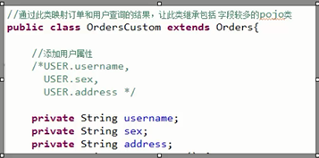

* mapper.xml
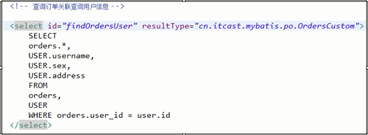

* mapper.java	
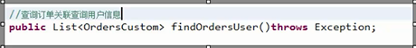

## resultMap

* sql语句
> 同resultType实现的sql

* 使用resultMap映射的思路

> 使用resultMap将查询结果中的订单信息映射到Orders对象中，在orders类中添加user属性，将关联查询出来的用户信息映射到orders对象中的user属性中  
> 需要orders类中添加user属性

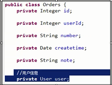

* resultMap的定义

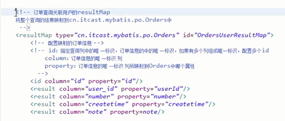

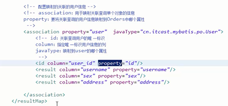

* mapper.xml
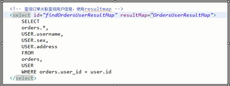

* mapper.java

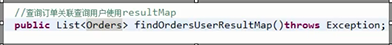

## resultType 和resultMap实现一对一查询小

1. resultType: 使用resultType实现较为简单，如果pojo没有查询出来的列名，需要增加列名对应的属性，即可完成映射。
2. 如果没有查询结果的特殊要求建议使用resultType.

3. resultMap:需要单独定义resultMap,实现有点麻烦，如果对查询结果有特殊的要求，使用resultMap可以完成将关联查询映射pojo的属性中。
4. resultMap可以实现延迟加载，resultType无法实现延迟加载。

# 一对多查询

* 需求
> 查询订单及订单明细的信息

* sql语句

> 确定主查询表：订单表  
> 确定关联查询表：订单明细表  
> 在一对一查询基础上添加订单明细表即可。  

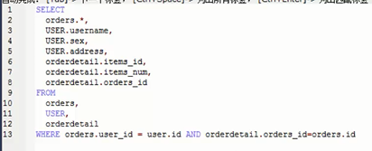

查询结果：  
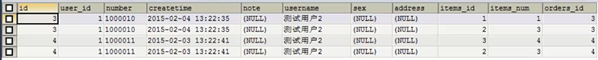  
因为一个订单对应多个订单明细，所以会出现订单信息重复的情况。

* 分析
> 使用resultType将上边的查询结果映射到pojo中，订单信息就会重复。

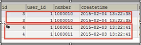

要求：  
对orders映射不能出现重复记录  
在orders.java类中添加List<orderDetail> orderDetails属性。  
最终会将订单信息映射到orders中，订单所对应的订单明细映射到orders中的orderDetails属性中。  

映射成的orders记录数为两条（对于以上查询结果）  
每个orders中的orderDetails属性存储了该订单所对应的订单明细。  

* 在orders中添加list订单明细属性
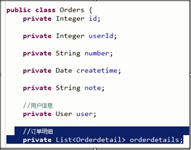

* mapper.xml

sql 语句修改为下面：  
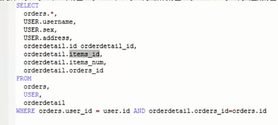

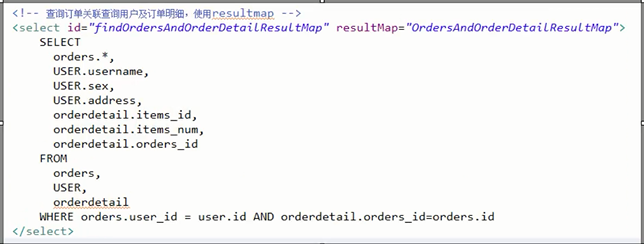

针对的是主表order   

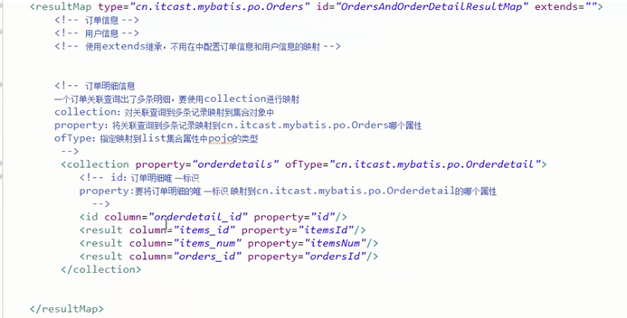

* mapper.java 

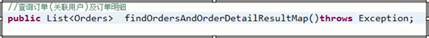
  

* 小结
> mybatis使用collection对关联查询的多条记录映射到一个list属性结合中。  
> 使用resultType实现  
> 将订单明细映射到orders中的orderDetail中，需要自己处理，使用双重循环遍历，去掉重复记录，将订单明细放在orderDetails中。

# 多对多查询

* 需求
>  查询用户及用户购买信息。

* sql语句

查询主表是：用户表  
关联表： 由于用户和商品之间没有直接关联，通过订单和订单明细进行关联，所以关联表：orders,orderDetails,items

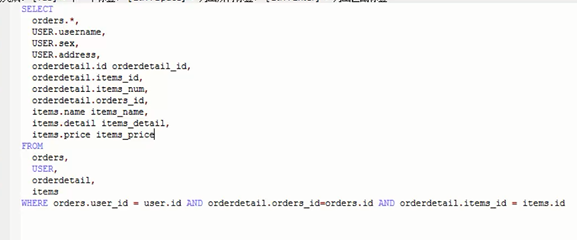

查询结果：    
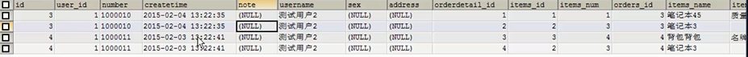

 * 映射思路

1. 将用户信息映射到user中
2. 在user类中添加订单列表属性List<Orders> orderlist,将用户创建的订单映射到orderlist.
3. 在orders中添加订单明细列表属性List<OrderDetails> orderDetails ,将订单的明细映射到orderDetails.
4. 在OrderDetail中添加items属性，将订单明细所对应的商品映射到items.

* mapper.xml    

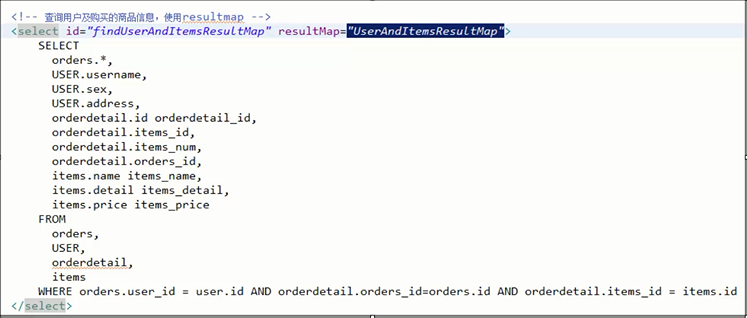

* resultMap定义

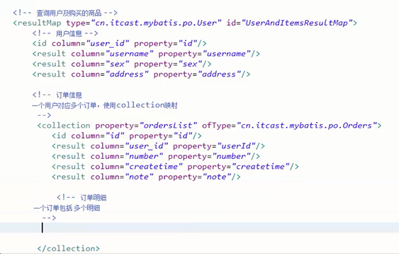

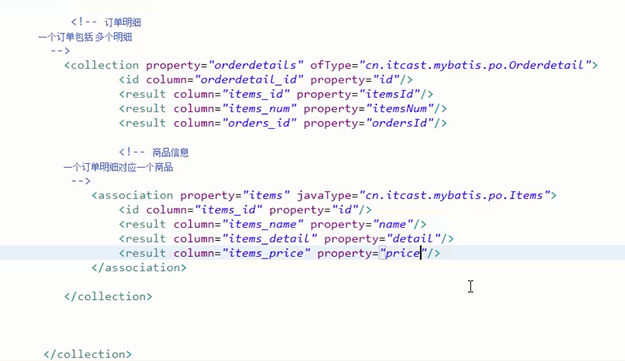

* mapper.java

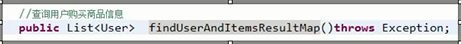 

## 多对多查询总结

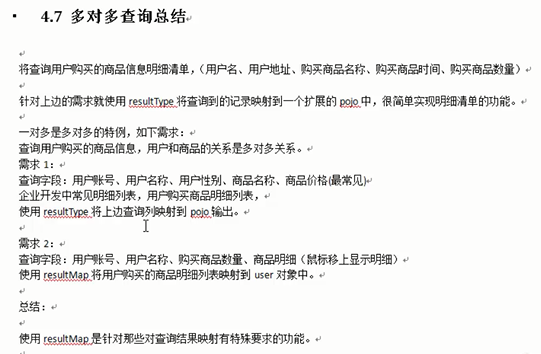

使用resultMap是针对那些对查询结果映射有特殊要求的功能，比如要求映射成List中包括多个list

# 延迟加载

## 什么是延迟加载？
> resultMap可以实现高级映射（使用association,collection实现一对一以及一对多的映射）,association,collection具备延迟加载的功能。

> 需求：  
> 如果查询订单并且关联查询用户信息。如果查询订单信息即可满足需求，当我们需要查询用户信息时在查询用户信息。把对用户信息的按需查询就是延迟加载。  

> 延迟加载：先从单表查询，需要时再从关联表去关联查询，大大提高数据库的性能。因为查询单表要比关联查询多表速度要快。

## 使用association实现延迟加载

* 需求
> 查询订单并且关联查询用户信息

* mapper.xml
> 需要定义两个mapper的方法对应的statement

1. 只查询订单信息
> select * from orders;  
> 在查询订单的statement中使用association去延迟加载（执行）下边的statement关联查询用户信息。

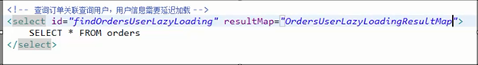  
2. 关联查询用户信息
> 通过上边查询到的订单信息中的user_id去关联查询用户信息。
使用userMapper当中的通过Id查询用户信息    

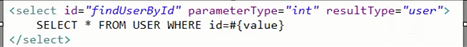

> 上边先去执行findOrdersUserLazyLoading,当需要去查询用户的时候再去执行fingUserById,通过resultMap的定义将延迟加载配置起来。

* 延迟加载的resultMap的定义
 > 使用association中的select指定延迟加载去执行的statement的id.
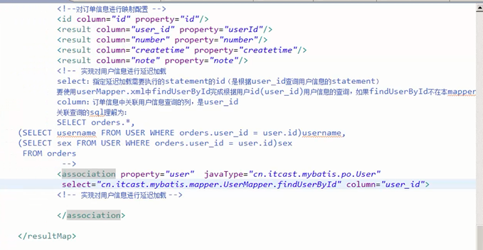

* mapper.java

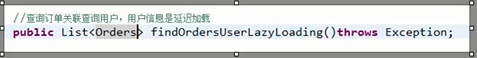

* 测试

	1. 执行上边mapper方法中(findOrdersUserLazyLoading）,内部去调用OrdersMapper中的findOrdersUserLazyLoading只查询orders信息（单表）。

	2. 在程序中遍历上一步骤查询出来的List<Orders>,当我们需要调用Orders中的getUser方法时，开始进行延迟加载。

	3. 延迟加载，去调用UserMapper.xml中findUserById这个方法获取用户信息。

* 延迟加载配置
> mybatis默认没有开启延迟加载，需要在sqlMapConfig.xml中setting配置  
  
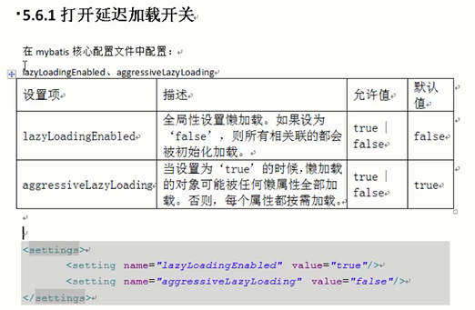
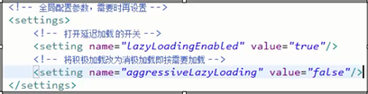

* 测试代码

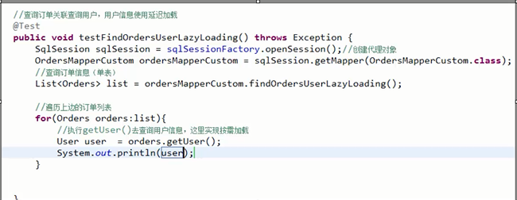

## 延迟加载思考

 不使用mybatis提供的association及collection中的延迟加载功能，如何实现延迟加载？  

定义两个mapper方法   
1. 查询订单列表  
2. 根据用户id查询用户信息。  

实现思路：  
先去查询第一个mapper方法，获取订单信息列表。  
在程序中，按需去调用第二个mapper方法去查询用户信息。

# 查询缓存

## 什么是查询缓存？  

mybatis提供查询缓存，用于减轻数据压力，提高数据库性能。  
mybatis提供一级缓存。  

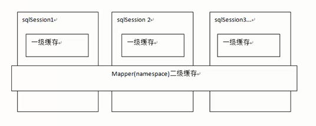

* 一级缓存是sqlSession级别的缓存。在操作数据库时需要构造sqlSession对象，在对象中有一个数据结构（HashMap）用于存储缓存数据。不同的SqlSession之间的缓存区域（HashMap）是互不影响的。

* 二级缓存是mapper级别的缓存，多个sqlSession去操作同一个Mapper的sql语句，多个sqlSession可以共用二级缓存，二级缓存是跨sqlSession的。

* 为什么要用缓存？
> 如果缓存中有数据就不用从数据库中获取，大大提高系统性能。

## 一级缓存

例：根据id去查询用户的一级缓存图解  
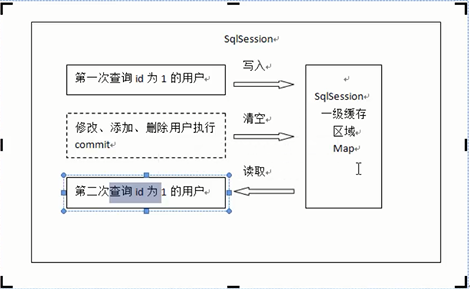

### 一级缓存原理 

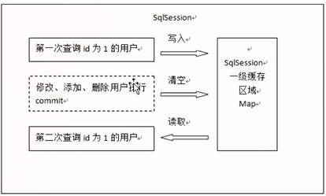

1. 第一次查询用户id为1的用户信息，先去缓存中查找是否有id为1的用户信息，如果没有，从数据库查询用户信息。得到用户信息，将用户信息存储到一级缓存中。

2. 如果sqlSession去执行commit操作（插入，修改，删除），清空sqlSession中的一级缓存，这样做目的为让缓存中存储的是最新的信息，避免脏读。

3. 第二次查询用户id为1的用户信息，先去缓存中查找是否有id为1的用户信息，缓存中有，直接从缓存中获取用户信息。

* 测试代码  

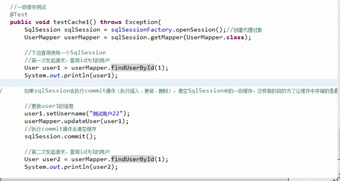

### 一级缓存的应用

正式开发，是将mybatis和spring进行整合开发，事务控制在service中。  
一个service方法中包括很多mapper方法调用。  

service  

		//开始执行时。开启事务，创建sqlSession对象
		//第一次调用mapper的方法findUserById(1)

		//第二次调用mapper的方法findUserById(1),从一级缓存中取数据。
		//方法结束，sqlSession关闭。

        如果是执行两次service调用查询相同的用户信息，不走一级缓存，因为service方法结束，sqlSession就关闭，一级缓存就清空。

## 二级缓存

### 二级缓存原理
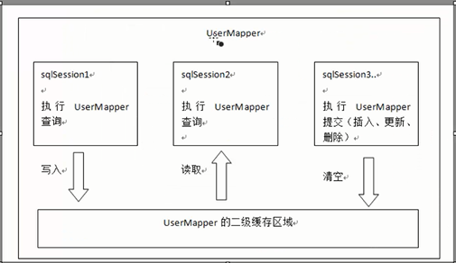

1. 首先开启Mybatis的二级缓存  
2. sqlSession1去查询用户id为1的用户信息，查询到用户信息将会存储到二级缓存中。  
3. 如果sqlSession3去执行相同的mapper下的sql，执行commit提交，缓存清空。  
4. sqlSession2去查询用户id为1的用户信息，去缓存中找是否存在数据，如果存在直接从缓存中取出数据。

* 二级缓存与一级 缓存的区别：
> 二级缓存的范围更大，多个sqlSession可以共享一个UserMapper的二级缓存区域。UserMapper有一个二级缓存区域（按namespace分），其他mapper也有自己的二级缓存区域（按namespace分）。每一个namespace的mapper都有一个二级缓存区域。两个mapper的namespace相同，则mapper执行sql查询到的数据将存在相同的二级缓存区域中。

* 开启二级缓存
> mybatis的二级缓存是mapper范围级别，除了在sqlMapConfig.xml中设置二级缓存的总开关，还要在具体的mapper.xml中开启二级缓存。  
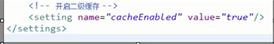

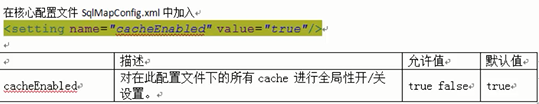

在userMapper.xml中开启二级缓存，UserMapper.xml下的sql执行完成会存储到它的缓存区域。（HashMap）  
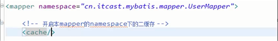

* 设置pojo 类实现序列化接口  

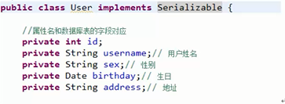  

为了将缓存数据去除执行反序列化操作，因为二级缓存数据存储介质多种多样，不一定在内存。

* 测试代码  
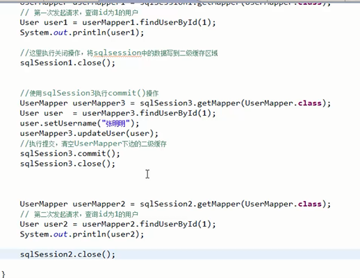

### 禁用二级缓存----useCache配置
> 在statement中设置useCache=false可以禁用当前select语句的二级缓存，即每次查询都会发出sql去查询，默认情况是true,即该sql使用二级缓存。 
 
      <select id="findOrderListResultMap" resultMap="orderUserMap" useCache="false">

总结：针对每次查询都需要最新的数据sql，要设置成useCache="false";禁用二级缓存。

### 刷新缓存（就是清空缓存）
> 在mapper的同一个namespace中，如果有其他insert ,update,delete操作数据后需要刷新
缓存，如果不执行刷新缓存会出现
脏读。  
> 设置statement配置中的flushCache="true"属性，默认情况下为true即刷新缓存，false则不会刷新，使用缓存时如果手动修改数据库表中的查询数据会出现脏读。
      <insert id="insertUser" parameterType="User" flushCache="true">

总结： 一般执行完commit操作都需要刷新缓存，flushCache=true表示刷新缓存，这样可以避免脏读。

## mybatis整合ehcache

ehchche是一个分布式缓存框架

### 分布式缓存
> 系统为了提高系统并发，性能，一般对系统进行分布式部署（集群部署方式）

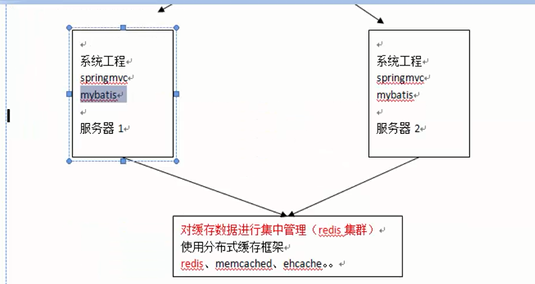

不使用分布缓存，缓存的数据在各个服务器单独存储，不方便系统开发。所以要使用分布式缓存对缓存数据进行集中管理。  

mybatis无法实现分布式缓存，需要和其他分布式缓存框架进行整合
  

* 整合方法（掌握）
> mybatis提供了一个cache接口，如果要实现自己的缓存逻辑，实现cache接口即可。

> mybatis和ehcache整合，mybatis和ehcache整合包中提供了一个cache接口的实现类。  

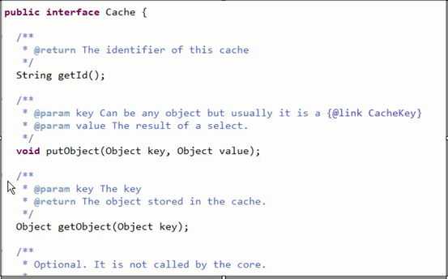

mybatis默认的cache的实现类  
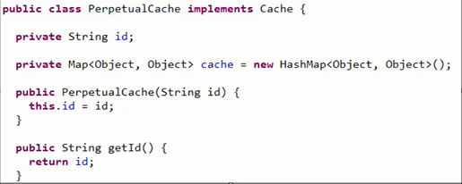

* 加入ehcachejar包   
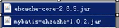 

* 整合ehcache   
> 配置mapper中的cache中的type为ehcache对cache接口的实现类型。
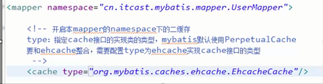

* 加入ehcache的配置文件  
> 在classpath中配置ehcache.xml
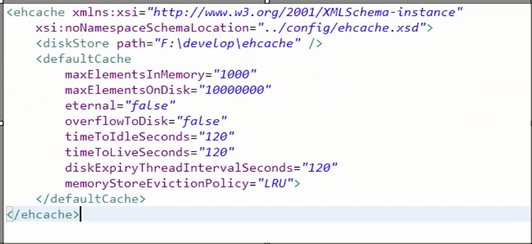

* 应用场景
> 对于访问多的查询请求且用户对查询结果实时性要求不高，此时可采用Mybatis的二级缓存技术降低数据库访问量提高访问速度，业务场景如，耗时较高的统计分析sql,电话账单查询sql等。  
>   实现方法：通过设置刷新间隔时间，由mybatis每隔一段时间自动清空缓存，根据数据变化频率设置缓存刷新间隔flushinterval,比如设置为30分钟，60分钟，24小时等，根据需求而定。

* 局限性  
> mybatis二级缓存对细粒度的数据级别的缓存实现不好，比如：对商品信息进行缓存，由于商品信息查询访问量大，但是要求用户每次都能查询最新的商品信息，此时如果使用mybatis的二级缓存就无法实现当一个商品变化时只刷新该商品的缓存信息而不刷新其他商品的信息，因为mybatis的二级缓存以mapper为单位划分，当一个商品商品信息变化会将所有商品的缓存数据全部清空，解决此类问题需要业务层根据需求对数据有针对性缓存。