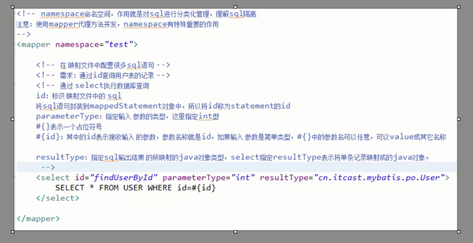
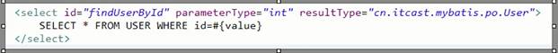
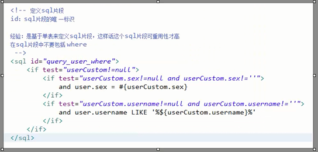

## JDBC 问题

* 注意
> connection  prepareStament  ResultSet  
> 释放的时候倒着释放

1. 数据库连接，使用时创建，不用时立即释放，对数据库进行频繁开启和关闭，造成数据库资源浪费， 影响数据库性能。
> 设想： 使用数据库连接池管理数据库连接

2. 将SQL语句<strong>硬编码</strong>到java代码中，如果sql语句修改，需要重新编译java代码，不利于系统维护。
> 将SQL语句配置在xml配置文件中，即使SQL变化，不需要对java代码进行重新编译。

3. 向prepareStatement中设置参数，对占位符位置和设置参数值，硬编码在java代码中，不利于系统维护。
> 将SQL语句及占位符和参数全部配置在xml中。

4. 从ResultSet中遍历结果集数据时，存在硬编码，将获取表的字段进行硬编码，不利于系统维护。
> 设想： 将查询的结果集，自动映射成JAVA对象。

# mybatis是什么？

* mybatis是一个持久化的框架，是apache下的顶级项目。

* mybatis托管到goolecode下，在后来托管到github下

* mybatis 让程序将主要精力放在sql上，通过mybatis提供的映射方式，自由灵活生成（半自动化，大部分需要程序员自己编写sql）满足需要的sql语句。      

* mybatis 可以将向preparedStatement中的输入参数自动进行输入映射，将查询结果，灵活映射成java对象（输出映射）

>  MyBatis 是支持普通 SQL查询，存储过程和高级映射的优秀持久层框架。MyBatis 消除了几乎所有的JDBC代码和参数的手工设置以及结果集的检索。MyBatis 使用简单的 XML或注解用于配置和原始映射，将接口和 Java 的POJOs（Plain Old Java Objects，普通的 Java对象）映射成数据库中的记录。

# 入门程序

*  mybatis文件下有Lib,lib下装的是依赖包，其中有log4jjar包，因此，要设置一下日志文件  ，即  log4j.properties .

* log4j.properties 设置级别为debug,不能设置为info
* 入门工程结构

#根据用户id来查询用户信息

* 配置SqlMapConfig.xml文件

* 创建pojo类

> pojo类的特点：
私有属性，部分或全部的属性的getter和setter方法，没有业务方法，可以没有无参构造器。它的出现是为了更方便的使用数据库中的表。

## 映射文件

* 映射文件文件名命名： User.xml(原始ibatis命名)，mapper代理开发映射文件名称叫做  xxxMapper.xml,......UserMapper.xml

* 在映射文件中配置sql

* 在sqlmapconfig.xml中加载映射文件

* 根据Id查询，所得结果映射成一个pojo类，现在查询到的是一条结果

* 根据name进行模糊查询
> 配置文件

# 小结

## parameterType ResultType

			parameterType   指的是输入类型
			ResultType      指的是输出类型

## #{} 和  ${}的区别

			#{} 指的是占位符
			${} 指的是拼接符   会引起sql语句的注入

## selectOne  与selectList  的区别

			selectOne  查询的结果有一条，将这一个结果进行映射，可以用selectList去接收
				
			selectList  查询的结果有多条，不可以用selectOne

# 添加用户

## 返回自增主键

## 返回非自增主键

* 使用mysqle的uuid()函数生成主键，需要修改表中Id字段类型为String ,  长度设置为35位。

* 执行思路
	1. 先通过uuid()查询到主键 输入到sql语句中。
	2. 执行uuid()语句顺序相对于insert语句之前执行

* 通过oracle的序列生成主键

			<selectKey keyProperty="id" order="before" resultTyp="java.lang.String" >
				SELECT 序列名.nextval()
			
			</selectKey>
			insert into user(id,name,money) values(#{id},#{name},#{money})

# 删除用户

# 更新用户

# Mybatis 和 hibernate 本质区别与应用场景

hibernate: 是一个标准的orm框架（对象关系映射）。入门门槛较高的，不需要程序员写sql，sql语句就生成了，对sql语句进行优化，修改比较困难的。

* 应用场景：

> 适用与需求变化不多的中小型项目，比如：后台管理系统，erp,orm,oa...

mybatis: 专注是sql本身，需要程序员自己编写sql语句，sql语句修改，优化比较方便。Mybatis是一个不完全的orm框架，虽然程序员自己写sql，mybatis也可以实现映射（输入映射，输出映射）

* 应用场景
> 适用与需求变化较多的项目： 比如  互联网项目

* 企业进行技术选型，以低成本，高回报作为技术选型的原则，根据项目组的技术力量进行选择。

# mybatis开发dao方法

## sqlSession适用范围

### sqlSessionFactoryBuilder

> 通过sqlSessionFactoryBuilder创建会话工厂sqlSessionFactory,将sqlSessionFactoryBuilder当成一个工具类即可，不需要适用单例管理sqlSessionFactoryBuilder.在需要创建的时候，只需要new一次sqlSessionFactoryBuilder即可。

### sqlSessionFactory

> 通过sqlSessionFactory创建sqlSession,使用单例模式管理sqlSessionFactory(工厂一旦创建，使用一个实例)。将来mybatis和spring整合后，使用单例模式管理sqlSessionFactory.

### sqlSession

* sqlSession是一个面向用户（程序员）的接口。

* sqlSession中提供了很多操作数据库的方法：如：selectOne(返回单个对象)，selectList(返回多个对象)。

* sqlSession是线程不安全的，在sqlSession实现类中除了有接口中的方法（操作数据库的方法）还有数据域属性。

* sqlSession最佳应用场合在方法体内，定义成局部变量使用。

# 原始DAO开发

> 总结原始Dao开发问题

1. dao接口实现类方法存在大量模板方法，设想能否将这些代码提取出来，减轻工作量。

2. 调用sqlSession方法时将statement的id硬编码了。

3. 调用sqlSession方法时传入的变量，由于sqlSession方法使用泛型，即使变量类型传错，在编译阶段也不会发现问题，不利于程序员开发。

# mapper代理方式（程序员只需要写mapper接口（相当于DAO接口））

* 思路

程序员还需要编写mapper.xml映射文件  
程序员编写mapper接口需要遵循一些规范，mybatis可以自动生成mapper接口实现类代理对象。

开发规范

1. 在mapper.xml中namespace等于mapper接口地址

2. mapper.java接口中的方法名和mapper.xml中的statement的id一致。

3. mapper.java接口中的方法输入参数类型和mapper.xml中statement的parameterType指定的类型一致。

4. mapper.java接口中的方法返回值类型和mapper.xml中statement的resultType一致。

* 总结
> 以上开发规范主要对下边代码进行统一生成

		User user = sqlSession.selectOne("test.findUserById",id);
		sqlSession.insert("test.insertUser",user);

* mapper.java

* mapper.xml

* 全局配置文件中加载映射文件

* 代码实现（生成代理对象）

# 一些问题总结

### 代理对象内部调用selectOne或者selectList

> 如果mapper方法返回单个pojo对象（非集合对象），代理对象内部通过selectOne查询数据库

> 如果mapper方法返回集合对象，代理对象内部通过selectList查询数据库。

### mapper接口中方法只能有一个参数是否影响系统开发

mapper接口方法参数只能有一个，系统是否不利于扩展维护  

系统框架中，dao层的代码是被业务层公用的。  

即使mapper接口只能有一个参数，可以使用包装类型的pojo满足不同的业务方法的需求。

注意： 持久层方法的参数可以包装类型，map...，service方法中建议不要使用包装类型（不利于业务层的可扩展）

# sqlMapConfig.xml

### 配置内容

sqlMapConfig.xml中配置的内容和顺序如下：

properties(属性)  

settings (全局配置参数) 

typeAliases(类型别名) 

typeHandlers(类型处理器) 

objectFactory(对象工厂) 

plugins(插件)  

enviroments(环境集合属性对象)  

  environment(环境子属性对象)

	 transactionManager(事务管理)
	 dataSource(数据源)

mappers(映射器)

## properties属性

需求：  
> 将数据库连接参数单独配置在db.properties中，只需要在sqlMapConfig.xml中加载db.properties的属性值。  
> 在sqlMapConfig.xml中就不需要对数据库连接参数硬编码。  

> 将数据库的连接参数只配置在db.properties中，原因：方便对参数进行统一管理，其他xml可以引用该db.properties

* properties特性

注意： Mybatis按照下面顺序加载属性

- 在properties元素体内定义的属性首先被读取

- 然后会读取properties元素中resource或者url加载的属性，它会覆盖已读取的同名属性。

- 最后读取parameterType传递的属性，它会覆盖已读取的同名属性。

因此，通过parameterType传递的属性具有最高优先级，resource或者url加载的属性次之，最低优先级是properties元素体内的属性。  

建议：  
> 不要在properties元素体内添加任何属性值，只将属性值定义在proeprties文件中。  
> 在proeprties文件中定义的属性名要有一定的特性，如：xxxx.xxxx.xx

* settings全局参数设置

mybatis框架运行时可以调整一些运行参数  
如： 开启二级缓存，开启延迟加载 

全局参数将会影响mybatis的运行行为。  

* typeAliases（别名）**重点**

> 在mapper.xml中，定义很多的statement需要parameterType指定输入参数的类型，需要resultType指定输出结果的映射类型。  

> 如果在指定类型时输入类型全路径，不方便进行开发，可以针对parameterType或者resultType指定的类型定义一些别名，在mapper.xml中通过别名定义，方便开发。

1. mybatis默认支持别名

2. mybatis自定义别名  
	a. 单个别名 

	
	b. 引用别名

	c.批量定义别名

 

* typeHandlers(类型转换器)

mybatis通过typeHandlers完成jdbc类型和java类型的转换。  

通常情况下，Mybatis提供的类型处理器满足日常需求，不需要自定义。

* mapper(映射配置)

1. 通过resource方法加载单个映射文件

2. 通过mapper接口加载映射文件

3. 批量加载mapper.xml文件

# 输入映射

> 通过parameterType指定输入参数的类型，可以是简单类型，hashmap,pojo的包装类型

## 传递pojo的包装对象

* 需求
> 完成用户信息的综合查询，需要传入的查询条件很复杂（可能包括用户信息，其他信息，如：商品，订单的）

* 定义包装类型pojo

> 针对需求，建议使用自定义的包装类型的pojo，在包装类型的pojo中将复杂的查询条件包装进去。

将各种自定义包装类组合在一起

### mapper.xml

### mapper.java

### 测试

# 输出映射

## resultType

1. 使用resultType进行输出映射，只有查询出来的列名和pojo中的属性名一致，该列才可以映射成功。

2. 如果查询出来的列名和pojo中的属性名全部不一致，没有创建pojo对象。

3. 只要查询出来的列名和pojo中的属性有一个一致，就会创建pojo对象。

* 输出简单类型

- 需求
> 用户信息的综合查询列表总数，通过查询总数和上边用户综合查询列表才可以实现分页

- mapper.xml

- mapper.java

- 测试

 

**查询出来的结果集只有一行且一列，可以使用简单类型进行输出映射**

* 输出pojo对象和pojo列表

> 不管输出类型是单个pojo对象，还是一个列表（list中包括pojo)，在mapper.xml中resultType指定的类型是一样的。在mapper.java指定的方法返回值类型不一样

1. 输出单个pojo对象，方法返回值是单个对象类型

2. 输出pojo对象list,方法返回值是List<pojo>

生成的动态代理对象中是根据mapper方法的返回值类型确定是调用selectOne还是selectList.

##resultMap

### 使用方法

如果查询出来的列名和pojo的属性名不一致，通过定义一个resultMap对列名和pojo属性名之间做一个映射关系。

1. 定义resultMap

2. 使用resultMap作为statement的输出映射类型

### 将下边的sql使用User完成映射

SELECT id id_,username username_ FROM USER WHERE id=#{value}

userCustom类中属性名和上边查询列名不一致。

1. 定义resultMap

2. 使用resultMap作为statement的输出映射类型

3. 测试  

## 小结

> 使用resultType进行输出映射，只有查询出来的列名和pojo中的属性名一致，该列才可以映射成功。

> 如果查询出来的列名和pojo中的属性名不一致，通过定义一个resultMap对列名和pojo属性名之间做一个映射关系。

# 动态sql

## if语句

## sql片段

* 定义sql片段
> 将sql判断代码块抽取出来，组成一个sql片段，其他的statement可以引用它。

* 使用sql片段
> 在定义的mapper.xml中的statement引用sql片段

## foreach语句

> 向sql传递数组或者list,mybatis使用foreach解析

需求

在用户查询列表和列表总数的statement中增加多个id输入查询。  
sql语句如下：
两种方法：  
1. SELECT * FROM user WHERE id =1 or id = 10 or id=16;

2. SELECT * FROM user WHERE id in(1,10,16);

* 测试

