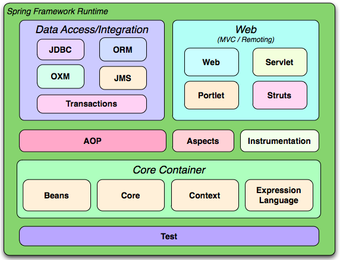

# spring介绍

## spring概述
>  spring是一个开源框架，于2003年兴起的一个轻量级的java开发框架，它是为了解决企业应用开发的复杂性而创建的。Spring使用基本的javabean来完成以前只可能由ejb完成的事情。然而，spring不仅可以用于服务器端的开发，从简单性，可测试性和松耦合的角度来看，任都何java应用都可以从中受益。  
>   简单说，spring是一个轻量级的控制反转（IOC）和面向切面（AOP）的容器框架。

## spring好处
* 方便解耦，简化开发
   - spring就是一个大工厂，专门负责生成Bean,可以将所有对象关系创建和依赖关系维护由spring管理。
* AOP编程的支持
   - spring提供面向切面编程可以方便的实现对程序进行权限拦截，运行监控等功能。  
* 声明式事务的支持
   - 只需要通过配置就可以完成对事务的管理，而无需手动编程。
* 方便程序的测试
   - spring对junit4支持，可以通过注解方便的测试spring程序。

* 方便集成各种优秀框架
   - 不排斥各种优秀的开源框架，其内部提供了对各种优秀框架（struts,hibernate,mybatis,quartz..）的支持。

* 降低javaee api的使用难度spring
  - 对javaee开发中一些难用的api（jdbc,javamail,远程webservice的调用），都提供了封装，使这些api应用难度大大降低。

## spring体系结构

# IOC
* inverse of control反转控制的概念，就是将原本在程序中手动创建UserService对象的控制权，交由Spring框架管理，简单说，就是创建Userservice对象控制权被反转到了spring框架。

* 有两种方式
    1. 依赖注入（dependency injection）简称di
    2. 依赖查找（dependency lookup）

# 加载spring容器的三种方式
* 类路径获得配置文件  
* 文件系统路径获得配置文件  
* 使用beanFactory

# 装配beans.xml

## 实例化bean的三种方式

* 使用构造方法实例化  
* 使用静态工厂实例化  
* 使用实例工厂方法实例化